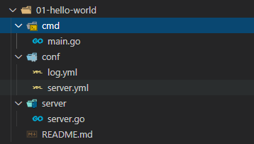
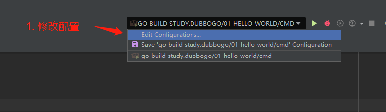
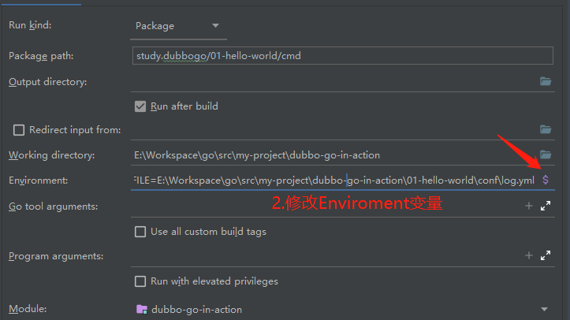
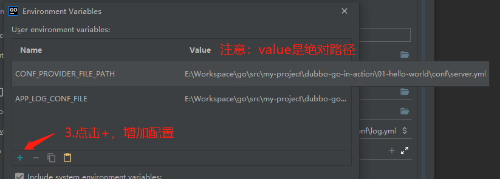
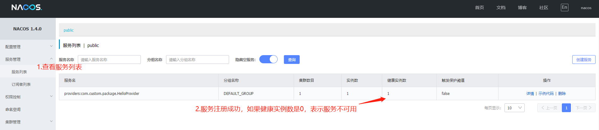
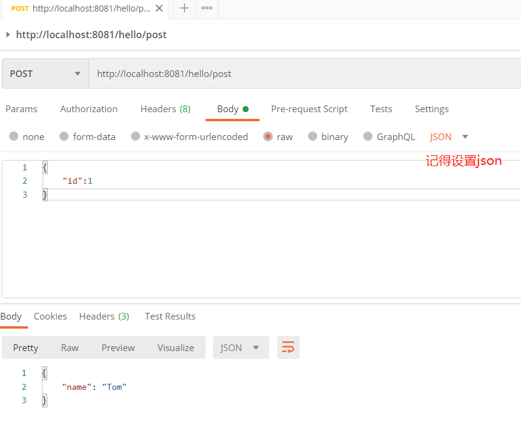

# 极简RESTful接口示例，帮你快速上手dubbo-go

本文主要介绍了一个极简的`RESTful`接口示例，不考虑负载均衡、限流等组件，服务启动后，直接浏览器访问即可，方便大家快速上手 `dubbo-go`

> 提示: 在阅读本文前，请确保服务注册中心已启动成功，如`nacos server`

完整代码请见 [hello-world](https://github.com/hbinr/dubbo-go-in-action/tree/learn/01-hello-world) 

## 第一步：安装dubbo-go

```go
go get -u github.com/apache/dubbo-go
```

## 第二步：编写 Provider 结构体和提供服务的方法

### Provider概览
`HelloWorldProvider`主要定义了三个方法：
- `SayHi(msg string) (string, error)`：GET请求，请求和响应都是简单的字符串
- `Who(req *PeopleReq) (res *PeopleRes, err error)`：POST请求，请求和响应都为结构体，我们使用JSON作为数据传输格式
- `Reference() string`：该方法为`RPCService`接口的方法，必须实现，这样才能注册到服务中心，其返回值是这个服务的唯一标识，对应 dubbo 的 `beans` 和 `path` 字段。至于底层逻辑是如何处理的，有兴趣的可以研究研究。在本案例中，先明白它是必须实现的，

**细节注意： 请求方法必须有`error`返回**

以下未设置返回值，即方法签名为： `SayHi(msg string) string`，框架启动便报错：
```go
common/rpc_service.go:363
    the latest return type string of method "SayHi" is not error
```

> 在Go规范中，如果有错误返回，默认是最后一个参数
### 代码
```go
package server

import (
	"fmt"

	"github.com/apache/dubbo-go/common/logger"
)

type PeopleReq struct {
	ID int64 `json:"id"`
}

type PeopleRes struct {
	Name string `json:"name"`
}

type HelloWorldProvider struct{}

func (h *HelloWorldProvider) SayHi(msg string) (string, error) {
	logger.Info("server: SayHi method,arg is ", msg)
	return fmt.Sprintf("Hello %s", msg), nil
}

func (h *HelloWorldProvider) Who(req *PeopleReq) (res *PeopleRes, err error) {
	logger.Info("server: Who method,arg is ", req)
	res = new(PeopleRes)
	res.Name = "Bob"
	if req.ID == 1 {
		res.Name = "Tom"
	}
	return
}

func (u *HelloWorldProvider) Reference() string {
	return "HelloWorldProvider"
}
```
引入`logger`的目的：
- 查看请求参数格式
- 使用`log.yml`配置
## 第三步：编写主程序
### 1.引入必需的`dubbo-go`package

```go
"github.com/apache/dubbo-go/config"
"github.com/apache/dubbo-go/protocol/rest/server/server_impl"
"github.com/emicklei/go-restful/v3"

_ "github.com/apache/dubbo-go/cluster/cluster_impl"
_ "github.com/apache/dubbo-go/common/proxy/proxy_factory"
_ "github.com/apache/dubbo-go/filter/filter_impl"
_ "github.com/apache/dubbo-go/protocol/rest"
_ "github.com/apache/dubbo-go/registry/nacos"
_ "github.com/apache/dubbo-go/registry/protocol"
```

**包作用解释：**

```go
"github.com/apache/dubbo-go/config"                              # config加载
"github.com/apache/dubbo-go/protocol/rest/server/server_impl"    # restful接口实现相关，如果是其他协议，无需导入此包
"github.com/emicklei/go-restful/v3"                              # restful接口实现相关，如果是其他协议，无需导入此包

_ "github.com/apache/dubbo-go/common/proxy/proxy_factory"        # 默认的代理工厂
_ "github.com/apache/dubbo-go/filter/filter_impl"                # filter for pshutdown
_ "github.com/apache/dubbo-go/protocol/rest"                     # restful协议相关，如果是其他协议，更换rest即可
_ "github.com/apache/dubbo-go/registry/nacos"                    # 服务注册中心相关，如果使用zookeeper的话，此处需换为zookeeper
_ "github.com/apache/dubbo-go/registry/protocol"                 # 服务注册相关
```
这一步导入了很多包，尤其是匿名导入的包，如果漏了一项，就会启动报错，然后根据报错信息，补充导入即可。

### 2. `main` 函数

```go
func main() {
	// 1.set provider,register service
	config.SetProviderService(new(server.HelloWorldProvider))

	// 2.add RESTfule server
	server_impl.AddGoRestfulServerFilter(func(request *restful.Request, response *restful.Response, chain *restful.FilterChain) {
		chain.ProcessFilter(request, response)
	})

	// 3.init config
	config.Load()
}
```
**细节注意：**

注册服务：`config.SetProviderService(new(server.HelloWorldProvider))`一定要记得在`config.Load()`之前。

另外，注册服务的步骤可以写在`server`包下的`init()`中，然后在`main.go`通过匿名导入方式引入：
```go
_ "study.dubbogo/01-hello-world/server"
```

## 第四步：编写配置
### 1.server.yml
为了方便大家快速上手，专门写了[server.yml配置说明](https://www.yuque.com/fmns3k/ydedam/hygl5q)

其中， **配置示例** 的内容可直接拷贝使用。

### 2.log.yml
`dubbo-go`日志配置主要是对Go知名日志库——[zap](https://github.com/uber-go/zap)的配置，其中`logger`使用的是`zap`的`SugaredLogger`。

具体参阅[log.yml配置说明](https://www.yuque.com/fmns3k/ydedam/oo752e)

其中， **配置示例** 的内容可直接拷贝使用。


## 第五步：启动程序
启动程序之前要先设置相关环境变量，这里讲解常用系统的环境变量设置
### 1.Linux/Mac环境
#### 1.1 `cd`到`main.go`所在目录，执行以下命令
```sh
export CONF_PROVIDER_FILE_PATH="../conf/server.yml"
export APP_LOG_CONF_FILE="../conf/log.yml"
```
**注意：** 环境变量的值是自定义的，以hello-world目录结构图为例：



#### 1.2 运行程序

```go
go run main.go
```

### 2.Windows环境
在Windows 10系统下，以使用Goland为例

#### 2.1 点击 `Edit Configurations...`



#### 2.2 点击 `$`，修改Enviroment设置

> 提示：如果该设置窗口过小，是会影响设置的，鼠标浮动到窗口边界便可以自更改窗口大小
#### 2.3 设置环境变量的值
分别设置以下环境变量即可
```sh
CONF_PROVIDER_FILE_PATH
APP_LOG_CONF_FILE
```


#### 2.4 运行程序

## 第六步：查看服务情况，并测试

### 查看服务情况
在Nacos注册中心->服务管理->服务列表里查看服务是否注册成功，如果成功的话，会显示服务具体信息：



需要关注的：
- 服务名： 即`server.yml`中配置的`interface : "com.custom.package.HelloProvider"`
- 实例数：注册的服务数量
- 健康实例数：如果为0，则服务不可用

### 测试
**GET请求测试：**

- 浏览器访问: http://localhost:8081/hello/get?msg=world，
- 页面响应:"Hello world"

**POST请求测试：**
如图：
