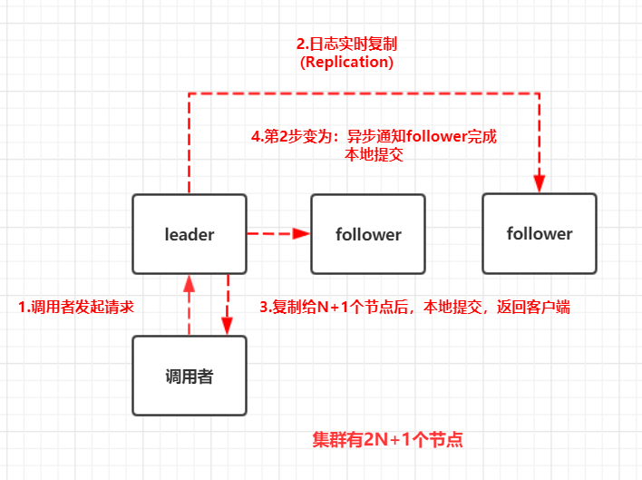

# 初识

## 核心特性

- 将数据存储在集群中的高可用 k-v 存储
- 允许应用实时监听存储中的 k-v 的变化
- 能够容忍单点故障,能够应对网络分区

## 核心原理

### 抽屉原理

桌上有十个苹果，要把这十个苹果放到九个抽屉里，无论怎样放，我们会发现至少会有一个抽屉里面放不少于两个苹果。

这一现象就是我们所说的“抽屉原理”。 抽屉原理的一般含义为：

> “如果每个抽屉代表一个集合，每一个苹果就可以代表一个元素，假如有 n+1 个元素放到 n 个集合中去，其中必定有一个集合里至少有两个元素。”

抽屉原理有时也被称为鸽巢原理。它是组合数学中一个重要的原理。

### etcd 与 Raft 的关系

- Raft 是**强一致**的**集群日志同步算法**
- etcd 是一个**分布式** KV 存储
- etcd 利用 Raft 算法在集群中同步 key-vaue

可以这么理解，etcd 管理 KV 的存储，而 Raft 是强一致的日志同步算法，那么将 kv 存储在 Raft 算法的日志中，那么 etcd 的 kv 就会自然的随着 Raft 算法在集群中完成同步，这样就实现了 **分布式 kv 存储**

### quorum 模型——大多数模型

集群的节点必须是奇数个——2N+1，这样才能满足抽屉原理，如 5 的大多数是 3；7 的大多数是 4。

Raft 协议原理图示(应用大多数模型)：

1. 调用者写入请求发给 leader 节点
2. leader 并不是马上响应调用者，而是先将日志实时的向 follower 复制，称为第一阶段：复制
3. 当 leader 将日志复制给 N+1 个节点后，leader 本地提交，返回客户端，称为第二阶段：提交。N+1 节点很关键，就是抽屉原理的应用
4. 一旦 leader 完成提交，接下来会将自己的提交信息周期性异步通知给剩余的 follower，这样所有的 follower 就能完成它们的本地提交。之所以改为异步是因为实时复制写入的的性能较差

Raft 协议可以理解为是一个二阶段协议，首先是 **复制**，一旦复制给大多数节点，leader 就可以先本地提交，告诉客户端提交成功；然后是 **提交**，集群剩余的所有节点的提交是异步处理的，不需要同步，只要确保日志**复制给大多数**就可以了

### Raft 日志概念

- `replication`：日志在 leader 生成，向 follower 复制，达到各个节点的日志序列最终一致
- `term`：任期，重新选举产生的 Leader，其 term 单调递增
- `log index`：日志行在日志序列的下标，**每个日志**都有一个**唯一**的下标

### Raft 安全的关键点

- 选举 leader 时需要半数以上的节点参与
- 节点 commit 日志最多的允许选举为 leader，commit 日志同样多，则 term、 index 越大的允许选举为 leader
- 提交成功的请求，一定不会丢
- 各个节点的数据将最终一致

# 安装

# Linux 安装
