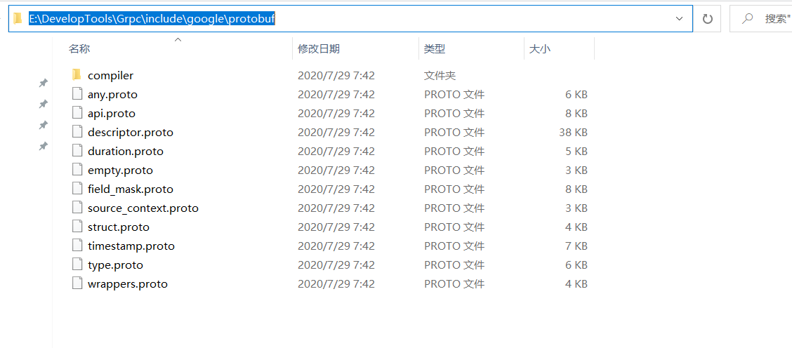

# grpc-go安装

## 一.grpc-go 安装

如果是使用go moudle 开发项目，直接导入以下包，IDE会自动安装：
```go
import "google.golang.org/grpc"
```
或者在终端执行命令：
```sh
$ go get -u google.golang.org/grpc
```

## 二.安装PB编译器

### 1.Windows安装
[2020-8-03]目前最新3.12.4版本安装：

https://github.com/protocolbuffers/protobuf/releases/tag/v3.12.4

下载后，将bin目下的执行文件 protoc.exe 移动到 GOPATH/bin目录下，这样就能使用 `protoc` 命令来生成相关go代码了。


### 2.不要忽略 include 文件夹中的内容

下载的压缩包里还有一个非常重要的目录 `include` 目录，里面存储了 grpc 认为不太常用的 `.proto` 文件，都是定义好的，可以直接 import 来使用的。include目录内容如图：



我们在实际开发的时候可能会用到里面相关的 .proto 文件，比如 timestamp.proto，这时候需要我们手动将其移动到项目中去。如图：


要在图中目录 `pbfile` 下运行生成代码命令，这样就可以 `import "google/protobuf/timestamp.proto";` 就不会报如下错误了：
>google/protobuf/timestamp.proto: File not found. 


