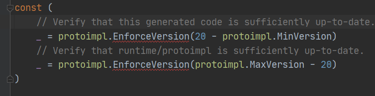
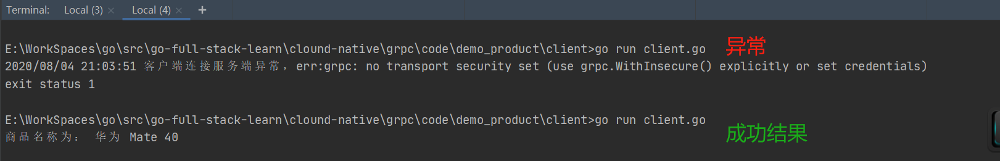

# gRPC 初步使用示例

## 一.创建 proto 文件

创建一个 `product.proto`，填入以下内容：
```go
// 使用 proto3 的语法
syntax = "proto3";

// 声明包名，别人可以通过其，将本文件中内容导入到自己的 .proto 文件来使用
package product_service;

option go_package = "go-full-stack-learn/clound-native/grpc/code/demo_product/pbfile";

// 请求消息
message ProdRequest {
  int32 prodID=1;
}
// 响应消息
message ProdResponse {
  string prodName=1;
}

// 远程调用服务
service ProdService{
  rpc GetProdName (ProdRequest) returns (ProdResponse);
}
```
**实现的服务：**
- 根据请求 prodID， 响应prodName

**注意：**
- option go_package 这行一定要加上，否则会报错：
> please specify it with the full Go package path as
a future release of protoc-gen-go will require this be specified.
See https://developers.google.com/protocol-buffers/docs/reference/go-generated#package for more information.

大意是添加一个 go package ，这样生成代码时候就能找到路径了(别处使用的时候也可以直接导入该路径)。否则 protoc 命令不知道是哪个路径下的`.proto`文件。

## 二.执行命令，生成go代码

cd到 `.proto` 文件所在的目录下

**执行以下命令：**
```sh
protoc --go_out=plugins=grpc:../service --go_opt=paths=source_relative product.proto 
```
执行该命令后会在 `../service` 路径(具体看命令参数的定义)下生成 `product.pd.go`文件，代码是自动生成的，不要乱改动，如果 `.proto` 文件定义的内容有改动，再重新生成一次即可。

**注意：**

- 第一次生成代码 xxx.pb.go 中会报错，原因是未导入 import 包裹的包。具体报错位置在图中红圈处



**解决:** cd 到 go.mod 所在路径下(即主项目路径)，执行命令 `go mod tidy`即可

## 三.创建服务端 server
创建一个grpc服务，对外提供。

新建一个 `server.go`，主要用来启动 grpc 服务，代码如下：

```go
package main

import (
	"go-full-stack-learn/clound-native/grpc/code/demo_product/service"
	"log"
	"net"

	"google.golang.org/grpc"
)

func main() {
	// 1.创建一个 rpc server
	rpcServer := grpc.NewServer()

	// 2.注册服务，即调用生成的代码中的方法. 参数：(server,创建的服务)
	service.RegisterProdServiceServer(rpcServer, new(service.ProdService))

	// 3.创建TCP连接 监听套接字
	lis, err := net.Listen("tcp", ":8081")
	if err != nil {
		log.Fatal("创建TCP连接异常,err:", err)
	}

	// 4.使用grpc，创建连接
	rpcServer.Serve(lis)
}
```

## 四.创建客户端 client

创建客户端来调用 grpc 提供的服务。

新建一个 `client.go`，主要用来调用 grpc 服务，代码如下：

```go
package main

import (
	"context"
	"fmt"
	"go-full-stack-learn/clound-native/grpc/code/demo_product/service"
	"log"

	"google.golang.org/grpc"
)

func main() {
	// 1.创建连接套接字，端口和服务端一致，并且先不使用HTTPS(即不安全调用)
	conn, err := grpc.Dial(":8081", grpc.WithInsecure())
	if err != nil {
		log.Fatal("客户端连接服务端异常，err:", err)
	}
	defer conn.Close()

	// 2.创建grpc客户端服务，即调用生成的代码中的方法
	prodClient := service.NewProdServiceClient(conn)

	// 3.调用远程服务，并处理响应
	prodResp, err := prodClient.GetProdName(context.Background(), &service.ProdRequest{ProdID: 10})
	if err != nil {
		log.Fatal("调用商品服务异常，err:", err)
	}

	fmt.Println("商品名称为：", prodResp.ProdName)
}
```

**注意**：在创建客户端连接时，需要使用 `grpc.WithInsecure()` 来表明此次连接是不安全的连接，否则会报以下错误
> 2020/08/04 21:03:51 客户端连接服务端异常，err:grpc: no transport security set (use grpc.WithInsecure() explicitly or set credentials)

大意是：未设置连接是安全的。可以使用 `grpc.WithInsecure()` 或 设置 `credentials`。

[使用安全连接的案例](/clound-native/grpc/docs/04_新增ssl证书—保证服务调用安全性.md)

## 五.检验服务

先运行服务端的 `server.go`来提供rpc服务，然后再运行 `client.go`，来查看结果，具体运行截图如下：



