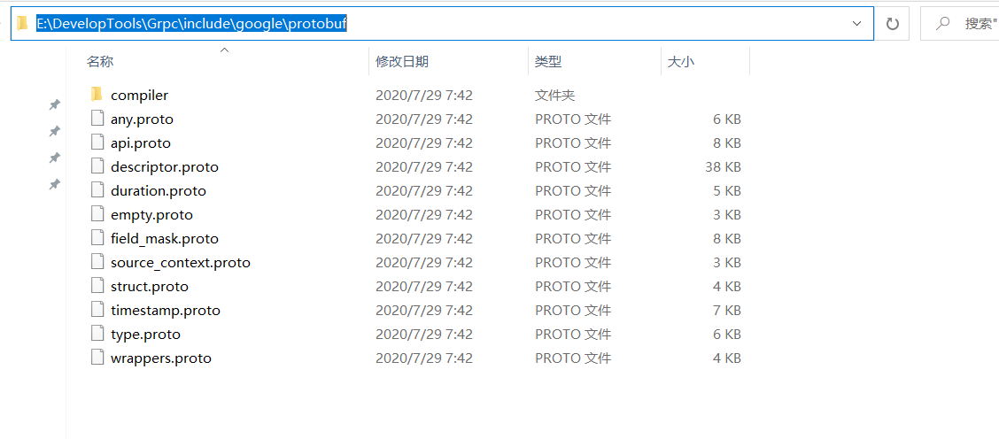
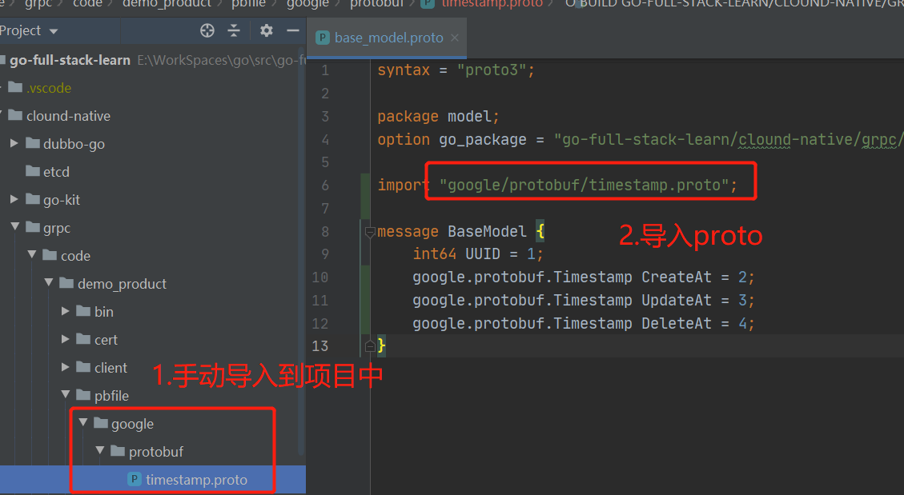

# 使用timestamp类型

## 一.手动导入 include 文件夹下的 timestamp.proto 文件
[下载的压缩包](https://github.com/protocolbuffers/protobuf/releases)里还有一个非常重要的目录 `include` 目录，里面存储了 grpc 预先定义好的 `.proto` 文件，可以直接 import 来使用的。include目录内容如图(Windows下)：



找到 timestamp.proto，并手动将其移动到项目中去。如图：



**注意：**
- 为了将官方定义的和自定义的区分开，专门在项目中增加了 google/protobuf 目录。
  
- 要在图中 `pbfile` 目录下运行生成代码命令，这样在 `import "google/protobuf/timestamp.proto";` 就不会报如下错误了：
> google/protobuf/timestamp.proto: File not found. 


## 二.定义自己的 proto 文件
`base_model.proto`文件新增了创建，修改，删除时间的定义：

```go
syntax = "proto3";

package model;
option go_package = "hb.study/clound-native/grpc/code/demo_product/pbfile";

// 1.导入timestamp.proto
import "google/protobuf/timestamp.proto";

message BaseModel {
    int64 UUID = 1;
    // 2.定义类型
    google.protobuf.Timestamp CreateAt = 2;
    google.protobuf.Timestamp UpdateAt = 3;
    google.protobuf.Timestamp DeleteAt = 4;
}
```

**注意：**
- 定义的时候，要全路径 `Timestamp` 声明变量，并且 `Timestamp` 首字母要大写

## 三.使用命令生成代码

我们重点看下结构体的定义，增加了相关时间字段，注意是 `*timestamp.Timestamp` 类型
```go
type BaseModel struct {
	state         protoimpl.MessageState
	sizeCache     protoimpl.SizeCache
	unknownFields protoimpl.UnknownFields

	UUID     int64                `protobuf:"varint,1,opt,name=UUID,proto3" json:"UUID,omitempty"`
	CreateAt *timestamp.Timestamp `protobuf:"bytes,2,opt,name=CreateAt,proto3" json:"CreateAt,omitempty"`
	UpdateAt *timestamp.Timestamp `protobuf:"bytes,3,opt,name=UpdateAt,proto3" json:"UpdateAt,omitempty"`
	DeleteAt *timestamp.Timestamp `protobuf:"bytes,4,opt,name=DeleteAt,proto3" json:"DeleteAt,omitempty"`
}
```

##  四.使用 timestamp 定义
在实现具体接口的时候，需要使用Timestamp。具体有两步：

- 1.定义时间戳，在我们生成的代码中，grpc已经帮我们实现了 timestamp 类型，所以会 `import "github.com/golang/protobuf/ptypes/timestamp"`
- 2.使用timestamp，grpc帮我们实现的时间戳是指针类型

具体代码如下：
```go
func (p *ProdService) GetProdInfo(ctx context.Context, req *ProdRequest) (*Product, error) {
	// 1.增加时间戳
	t := timestamp.Timestamp{Seconds: time.Now().Unix()}
	return &Product{
		BaseModel: &BaseModel{
            UUID:     10000001,
            // 2.使用timestamp类型
			CreateAt: &t,
		},
		ProdID:    1,
		ProdName:  "华为 P10",
		ProdPrice: 6999.00,
	}, nil
}
```