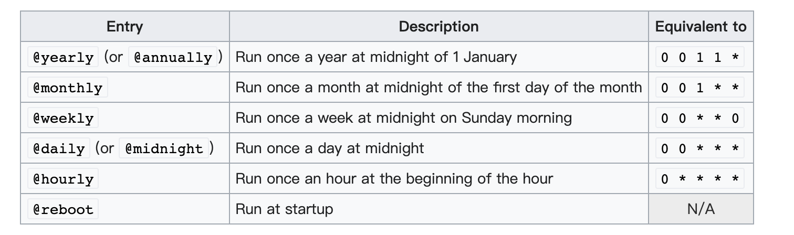
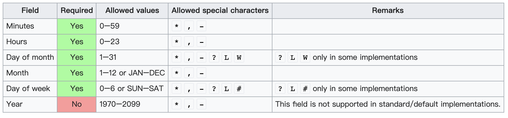

# Cron 基本使用
- [官方Wiki](https://en.wikipedia.org/wiki/Cron)

## 概述
cron的行动是由`crontab`（cron表）文件驱动的，该文件是一个配置文件，它指定了按给定时间表定期运行的shell命令。

`crontab`文件是保存Job 列表和其他对cron守护程序的指令的地方。用户可以有自己单独的`crontab`文件，通常有一个全系统的 `crontab` 文件（通常在/etc或/etc的一个子目录下，如/etc/cron.d），只有系统管理员可以编辑。

`crontab`文件的每一行代表一项工作，看起来如下：
```shell
# ┌───────────── minute (0 - 59)
# │ ┌───────────── hour (0 - 23)
# │ │ ┌───────────── day of the month (1 - 31)
# │ │ │ ┌───────────── month (1 - 12)
# │ │ │ │ ┌───────────── day of the week (0 - 6) (Sunday to Saturday;
# │ │ │ │ │                                   7 is also Sunday on some systems)
# │ │ │ │ │
# │ │ │ │ │
# * * * * * <command to execute>
```
每一行的语法都希望有一个由五个字段组成的cron表达式，代表执行命令的时间，后面是要执行的shell命令。

通常情况下，当时间/日期规范字段都与当前的时间和日期相匹配时，作业就会被执行。

但有一个例外：如果 `day of the month (1 - 31)`（字段3）和 `month (1 - 12)`（字段5）都有限制（不是 `*`），那么其中一个或两个都必须与当前日期相匹配。

例如，假设cron用户的默认shell是符合Bourne shell的，那么下面的内容就会在**每天午夜1分钟（00:01）**清除Apache的错误日志。
```shell
1 0 * * * printf "" > /var/log/apache/error_log
```

例如，在每周六23:45（晚上11:45）运行一个名为`export_dump.sh`的shell程序。
```shell
45 23 * * 6  export_dump.sh
```

**注意：**
也可以指定`*/n`来运行每n个时间间隔。另外，指定多个特定的时间间隔可以用逗号来完成（例如，1,2,3）。

下面的例子将在 1点、2点、3点开始执行命令，并且每隔5分钟向命令行输出 "hello world"，即01:00、01:05、01:10，都会输出 "hello world"，直到03:55。
```shell
*/5 1,2,3 * * * echo hello world
```

用户的配置文件可以通过调用`crontab -e`来编辑，而不管实际的实现将这个文件存储在哪里。

一些 `cron` 实现，例如由Paul Vixie编写的流行的[4th BSD edition](https://en.wikipedia.org/wiki/Berkeley_Software_Distribution)，包括在许多Linux发行版中，增加了**第六个**字段：一个运行指定工作的**账户用户名**（取决于用户的存在和权限）。

这只允许在系统的`crontabs`中使用--而不允许在其他的`crontabs`中使用，这些`crontabs`都是分配给一个用户来配置的。第六个字段有时也被用来代替账户用户名——如Windows的`nncron`守护程序就是这样。

The Amazon EventBridge 对 `cron` 的实现不使用基于0的星期，而是 1-7 SUN-SAT（而不是0-6），以及支持额外的表达功能，如第一周日和每月最后一天。

## 非标准的预定义调度定义 Nonstandard predefined scheduling definitions
一些cron实现支持以下非标准的宏。



`@reboot`配置一个作业，在守护进程启动时运行一次。由于`cron`通常不会被重新启动，这通常与机器被启动相对应。这种行为在一些`cron`的变体中被强制执行，比如在`Debian`中提供的，[所以简单地重启守护进程并不会重新运行`@reboo`作业。

如果需要在一个特定的用户下启动一个服务器或守护程序，而该用户没有权限配置`init`来启动该程序，那么`@reboo`就很有用。

## Cron 表达式
CRON表达式是一个由五个或六个字段组成的字符串，用空格隔开[16]，表示一组时间，通常是执行某些程序的时间表。

注释以注释标记#开始，并且必须单独成行。



月份和工作日的缩写不区分大小写。

在系统`crontab`文件（`/etc/crontab`）的特殊情况下，一个用户字段插入到 `command` 前。它通常被设置为 "root"。

在`CRON`格式的某些用途中，在模式的开头也有一个秒字段。在这种情况下，`CRON`表达式是一个由6或7个字段组成的字符串[17] 。

### 逗号 ( , )
逗号用于分隔列表中的项目。例如，在第5个字段（星期）中使用 "MON,WED,FRI "意味着星期一、星期三和星期五。
### 破折号 ( - )
破折号定义了范围。例如，2000-2010表示2000年和2010年之间的每一年，包括在内。
### 百分比 ( % )
命令中的百分号（%），除非用反斜杠（\）转义，否则会变成**换行字符**，第一个`%`之后的所有数据都作为**标准输入**发送到命令中。

## 非标准字符
以下是非标准字符，只存在于某些cron实现中，比如Quartz Java调度器。

### L
L "代表 "last"。当使用在星期中时，它允许指定诸如 "最后一个星期五"（"5L"）这样的结构。在`day-of-month`中，它指定了该月的最后一天。
### W
`day-of-month`字段允许使用 "W "字符。

这个字符用于指定离给定日期最近的工作日（周一至周五）。例如，如果 "15W "被指定为`day-of-month`的值，其含义是："离本月15日最近的工作日"。

因此，
- 如果15日是星期六，触发器在14日星期五启动。
- 如果15号是星期天，触发器在16号星期一启动。
- 如果15号是星期二，那么它就在15号星期二触发。

然而，如果 "1W "被指定为`day-of-month`值，并且1号是星期六，那么触发器在3号星期一发射，因为它不会 "跳过 "一个月的天数界限。只有当`day-of-month`是一个单一的日子，而不是一个范围或日子列表时，才能指定 "W "字符。
### Hash(#)
`day-of-week`字段允许使用'#'，后面必须有一个1到5之间的数字。例如，在`day-of-week`字段中输入 "5#3"，就相当于每个月的第三个星期五。
### 问号(?)
在一些实现中，用来代替`*`，用于留出`day-of-month`或`day-of-week`的空白。其他的cron实现方式用cron守护进程的启动时间代替`?`。

因此`? ? * * * *`，如果cron在早上8点25分启动，将被更新为`25 8 * * *`，并且每天都会在这个时间运行，直到再次重启。
### 斜线 (/)
在`vixie-cron`中，斜线可以与范围相结合来指定**step值**。

例如，分钟字段中的`*/5`表示每5分钟一次（见下面关于频率的说明）。它是对更多的`POSIX` 形式 5、10、15、20、25、30、35、40、45、50、55、00的速记。

`POSIX`没有定义斜线的用途；它的理由（对BSD扩展的评论）指出，该定义是基于`System V`格式的，但不排除扩展的可能性[6] 。

**注意：**
一般来说，频率是无法表达的；

只有均匀划分其范围的步长值才能表达准确的频率（对于分和秒，就是/2、/3、/4、/5、/6、/10、/12、/15、/20和/30，因为60被这些数字均匀地分割了。对于小时，是/2、/3、/4、/6、/8和/12）；

所有其他可能的 "step"和所有其他字段在时间单位结束时产生不一致的 "short" 时间，然后再 "重置 "到下一分钟、第二秒或一天。

例如，在`day`字段中输入`*/5`，有时会在1天、2天或3天后执行，这取决于月份和闰年；这是因为cron是无状态的（它不记得上一次执行的时间，也不计算它与现在之间的差异，这是精确频率计算所需要的--相反，cron只是一个模式匹配器）。

### H
在Jenkins持续集成系统中，"H "被用来表示一个 "hashed"值被替换。因此，`H * * *`不是一个固定的数字，如`20 * * *`，表示每小时后20分钟，`H * * *`表示每小时在一个未指定的但不变的时间执行任务。这允许在一段时间内分散任务，而不是让所有的任务在同一时间开始并竞争资源。