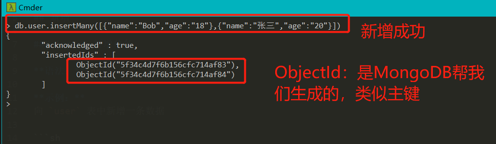

MongoDB 增删改查命令操作

MongoDB CRUD 命令的 API 非常直观简洁，很快就能上手，因为其操作命令非常吻合开发者习惯

## 新增

### insert 新增单条

**语法：**`db.集合名.insert(json data)`

**示例：**
向 `user` 表中新增一条数据

```sh
db.user.insert({"name":"Bob","age":"18"})
```

### insertMany 新增多条

**语法：**`db.集合名.insertMany(json data)`

`json data` 为数组格式
**示例：**
向 `user` 表中新增多条数据

```sh
db.user.insertMany([{"name":"Bob","age":"18"},{"name":"张三","age":"20"}])
```

如图；


## 修改

###
