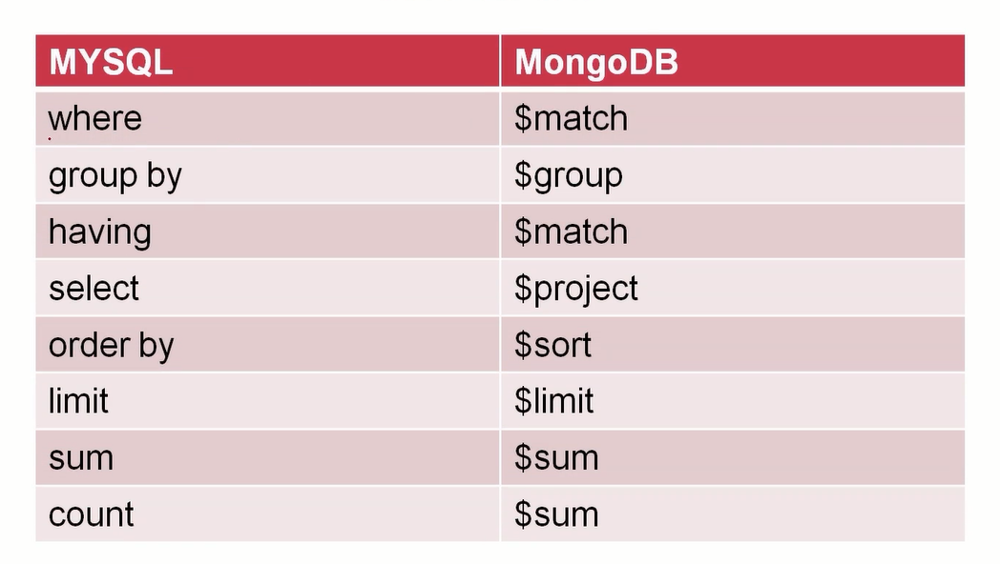

## msyql 个 MongoDB 聚合操作类比



## 聚合示例

1 不同爱好人数的数据统计，展示爱好和数据总量

```mongodb
db.test1.aggregate([{$unwind:'$likes'},{$group:{id:{likes:'$likes'}}},{$project:{_id:0,hobby:'_id.likes',total:{$sum:1}}}])
```

- aggregate：pipeline 流式计算，功能复杂，可以实现复杂查询

输出：

> {"like":"football","total":2} {"like":"basketball","total":3}
