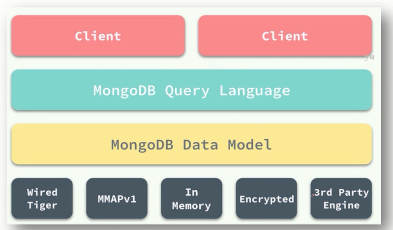
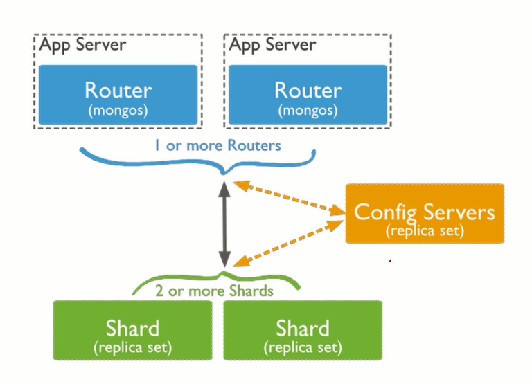
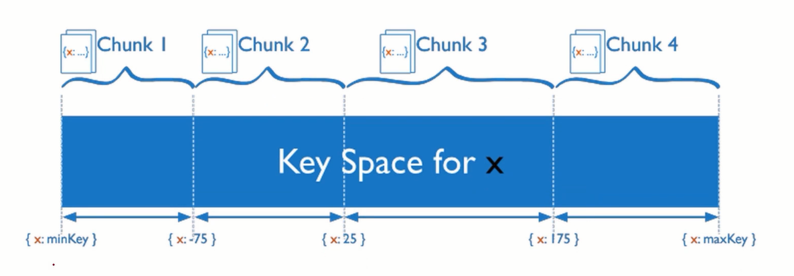
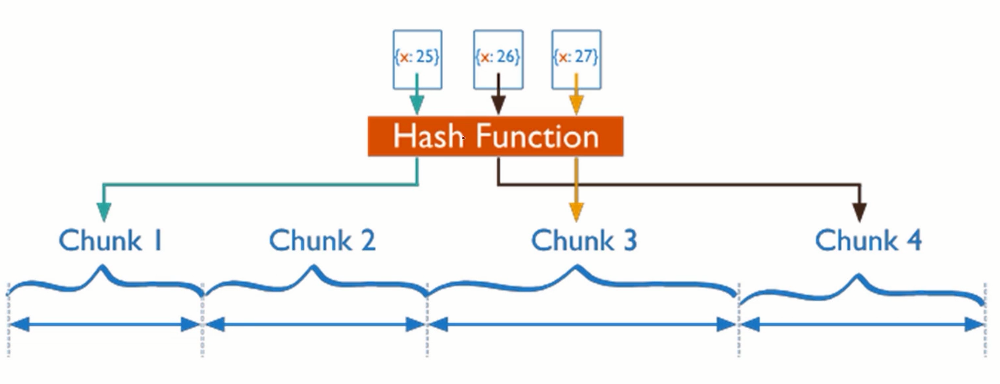

# MongoDB 原理

## 整体存储架构

- Mongod：单机版数据库
- Replica Set：复制集，由多个 Mongod 组成的高可用存储单元。可以理解为是多个 Mongod 组成的集群，它们内部会做数据备份，不会因为单点 Mongod 故障而导致复制集不可用
- Sharding：分布式集群，由多个 Replica Set 组成的可扩展集群

## Mongod 架构

最外层客户端 `client` 发起请求，然后进入查询层 `MongoDB Query Langua`，把请求解析，查询，最后把结果写入存储层 `MongoDB Data Model`，该层进行了一个抽象 `Data Model`

- MongoDB 支持不同的存储引擎，默认采用 WiredTiger 高性能存储引擎，3.X 版本之后都用
- 基于 journaling log 宕机恢复(类比 mysql 的 redo log)

journaling log ：

当写入数据的时候，先是去写 `log`，把要做的事情写到一个顺序追加的 log 文件里。因为磁盘善于做顺序写入，所以数据可以高效的暂时修改在内存里，然后定期的将内存中的数据写入到磁盘里。

如果在将内存中的数据写入到磁盘就宕机的话，mongod 重启后会根据之前写好的 log，将数据加载出来，再写入到磁盘。

整个过程并不是实时的往磁盘里写数据，而是先写 log，然后再将数据写入磁盘

## Replica Set 架构

Replica Set 由多个 Mongod 组成，其有主从节点，一主多从。数据写入到主节点，然后同步给从节点，如果主节点宕机，Replica Set 会重新选主，然后客户端就可以写入到新的主节点上，不会发生造成服务不可用。

- 至少 3 个节点组成,其中 1 个可以只充当 arbiter(投票公断者)
- 主从基于 oplog 复制同步(类比 mysql binlog)
- 客户端默认读写 primary 节点，可以自定义修改权限去读写从节点。不过不推荐，因为从节点数据复制是异步的，所有有些数据是旧的，有些读取不到。

## Sharding 架构

- mongos 作为代理，路由请求到特定 shard
- 3 个 mongd 节点组成 config server，保存数据元信息。
- 每个 shard 是一个 replica set，可以无限扩容

## Colleciont 分片

- Collection 自动分裂成多个 chunk(即图中白色的方块)
- 每个 chunk 被自动负载均衡到不同的 shard
- 每个 shard 可以保证其上的 chunk 高可用

### 一个 Collection 表如何切分 chunk

#### 按 range 切分 chunk

- Shard key 可以是单索引字段或者联合索引字段
- 超过 16MB 的 chunk 被一分为二
- 一个 collection 的所有 chunk 首尾相连，构成整个表，如图所示

**缺点就是有写入热点问题**：

假设 x 字段是时间类型，那么往 MongoDB 写很多数据的时候，而数据的时间都是当前时间，那么就会将数据写入到同一个 chunk 中，因为时间都是当前时间，虽然不可能完全相同，但是都是相近的。这样就导致某一个 chunk 特别忙，而其他 chunk 又特别闲

#### 按 hash 切分 chunk

可以解决写入热点问题

x(单调递增) 取模，然后根据结果，将数据分散到不同的 chunk

- Shard key (即 x 值)必须是哈希索引字段
- Shard key 经过 hash 函数打散，避免写热点
- 支持预分配 chunk，避免运行时 chunk 分裂影响写入。

**注意**：

- **哈希索引**

MongoDB 支持哈希索引，它会先把索引字段进行 hash，得到一个整型数据，然后对这个整型数据建立索引。

但是 hash 是有冲突率的，不同的值可能会得到相同的 hash，那么就会出现一个问题：MongoDB 无法保证 hash 索引字段的唯一性，因为不同的值会 hash 成相同的索引。

因此，MongoDB 不允许对 hash 所以建立主键。

- **chunk 分裂**

这种情况发生数据集中写入到某个 chunk，导致该 chunk 的内存超过阈值（16MB）会一分为二。在分裂的一段时间内，数据写入会受到吞吐的影响，并不如平时的性能高。

如果预分配了 chunk，就可以避免 chunk 被写满而分裂的情况
