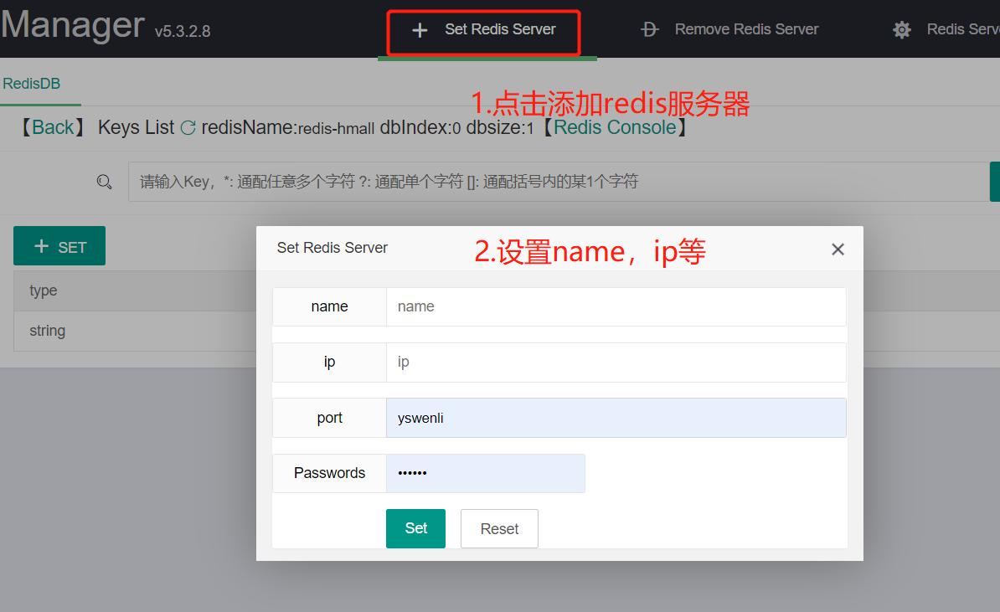

## 一.Redis 初识

Redis 是⼀种基于键值对（key-value）的 NoSQL 数据库，与很多键值对数据库不同的是，Redis 中的值可以是由 string（字符串）、hash（哈希）、list（列表）、set（集合）、zset（有序集合）、Bitmaps（位图）、HyperLogLog、GEO（地理信息定位）等多种数据结构和算法组成，因此 Redis 可以满⾜很多的应⽤场景，⽽且因为 Redis 会将所有数据都存放在内存中，所以它的读写性能⾮常惊⼈。

不仅如此，Redis 还可以将内存的数据利⽤快照和⽇志的形式保存到硬盘上，这样在发⽣类似断电或者机器故障的时候，内存中的数据不会“丢失”。除了上述功能以外，Redis 还提供了键过期、发布订阅、事务、流⽔线、Lua 脚本等附加功能。

**特性：**

1. 速度快
2. 持久化
3. 多种数据结构
4. 支持多种编程语言
5. 功能丰富
6. 简单
7. 支持主从复制
8. 高可用，分布式

## 二.Deepin 安装 Redis

### 1.Deepin (Linux 系统)

输入以下命令即可（不推荐）：

```
sudo apt-get install redis-server
```

使用 apt-get 安装 redis 后，不便于统一管理，另外该 redis 版本为 3.0 的版本，现在都 6.0+的版本了。

个人习惯将外部安装的软件都归类，比如放到 soft/目录下

1.在 opt 目录下创建 soft 目录,并修改 soft 目录权限

```
cd opt/
sudo mkdir soft
sudo chmod 777 soft    # 仅把soft目录的权限设置为rwxrwxrwx

或 sudo chmod -R 777 soft # 表示将整个soft目录与其中的文件和子目录的权限都设置为rwxrwxrwx
```

必须修改权限，我是 Deepin v20 beta 版本的系统，新建的 soft 的目录写权限，所以需要修改权限

2.在 soft 目录下安装 redis 5.0.5 版本并解压

```
cd soft
wget http://download.redis.io/releases/redis-6.0.4.tar.gz
tar xzf redis-6.0.4.tar.gz
```

至于为什么没有安装 6.0+版本，是因为现在国内下载需要翻墙，没梯子的话需要设置 yum 源等等，比较麻烦。(我弄了好久还是没弄好)

为了学习 Redis，毕竟还是先学好知识，后来选择了 5.0.5 版本。

3.创建软连接

为了方便 redis 的目录管理，以及升级版本，在当前目录下建立一个软连接

```
ln -s redis-5.0.5 redis   # 将redis-5.0.5挂在redis软连接上，改名称(redis)是自定义的
```

4.编译

```
cd redis

make
```

等一小会儿后，就编译完成了，在当前目录执行：

```
src/redis-server
```

就启动了 redis 服务器，ctrl + c 可以直接退出

但是只能在当前 redis 目录下可以执行改命令，就需要 make install

5.make install

```
sudo make install
```

这样做的理由是：希望在全局，任意地方执行 redis-server 都能够成功，不然会报 redis-server 命令找不到。

至此，安装完成。

### 2.各文件解释

1. redis-server redis 服务器
2. redis-cli redis 客户端
3. redis-benchmark redis 基准测试
4. redis-check-aof
5. redis-chek-dump
6. redis-sentinel sentinel 服务器（2.8 以后）

### 3.验证
输入以下命令：
```
redis-server # 启动服务器

redis-cli # 启动客户端

```
实例：
```

duanhaobin@duanhaobin-PC:~\$ redis-cli
127.0.0.1:6379> ping
PONG
````
### 4.三种启动方法
1. redis-server  使用默认配置启动
2. 动态参数  --port  设置端口，如: redis-server  --port  8003
3. 配置启动   redisConfig 生产环境建议选择，如：redis-server  redisConfig
## 三.Docker 安装

全程都是 root 用户

### 1.下载镜像文件

输入命令，默认下载最新版本 ：

```sh
docker pull redis
### 2.创建实例并启动

由于 redis 容器中并没有 redis.conf 文件，所有要先创建好 redis.conf 配置文件

```sh
mkdir -p /mydata/redis/conf

touch /mydata/redis/conf/redis.conf
```

使 redis 持久化存储数据，要在 redis.conf 中加入以下内容：

> appendonly yes

持久化数据是保存在data目录下，所以也需要挂在一个`data`目录：
```sh
mkdir -p /mydata/redis/data
```

更多[官网配置](https://redis.io/topics/config)

**启动 redis：**

```sh
docker run -p 6379:6379 --name redis \
-v /home/hblock/MyData/redis/conf/redis.conf:/etc/redis/redis.conf \
-v /home/hblock/MyData/redis/conf/data:/data \
-d redis redis-server /etc/redis/redis.conf

# mac os 
docker run -p 6379:6379 --name redis \
-v /etc/redis/redis.conf:/etc/redis/redis.conf \
-v /var/lib/redis:/data \
-d redis redis-server /etc/redis/redis.conf
```

- -v 相关参数，表示 Linux 主机 和 Redis 容器挂载相应目录
- -d redis redis-server /etc/redis/redis.conf 表示启动 redis-server，并且以 redis.conf 配置启动

**补充:** Windows下使用docker创建redis
```sh
docker run -p 6379:6379 --name redis \
-v E:\\mydata\\redis\\conf\\redis.conf:/etc/redis/redis.conf \
-v E:\\mydata\\redis\\data:/data \
-d redis redis-server --appendonly yes    # 在创建容器时，直接增加持久化配置
```
### 3.验证安装是否成功

**使用 Redis 镜像执行 redis-cli 命令连接 redis 容器**

```sh
docker exec -it redis redis-cli
```

分别执行命令：`set a hello`和 `get a`，有正常显示即表示安装成功

## 四.Windows 安装 Redis 可视化工具安装与连接

Web Redis Manager 是一款 web 版的 Redis 可视化工具，即可以作为单机的 web 版的 Redis 可视化工具来使用，也可以挂在服务器上多人管理使用的 web 版的 Redis 可视化工具。

### 1.下载并解压

首先下载https://github.com/yswenli/WebRedisManager/releases包，并解压打开，进入net462文件夹

双击文件 WebRedisManager.exe 运行，如果无法运行的话，可能需要安装.net framework 4.6.2 或 core3.1。

运行成功会弹出一个命令行终端，提示你打开：http://127.0.0.1:16379/ 地址。

成功打开界面如下：


### 2.添加 redis 服务器

如图，点击 **Set Redis Server** 按钮添加：



### 3.添加成功点击左侧显示的 db，即可进行 redis 的增删改成

### 4.点击 Redis Console 进入命令行模式


## 三.Mac 安装Redis

```sh
brew install redis
```

参考：
- https://www.cnblogs.com/fazero/p/10517906.html