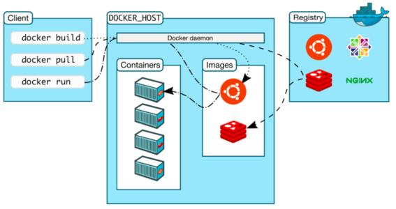

# Docker 的基本组成

## Docker 架构图

## Docker 基本概念

#### 镜像(image):

- docker 镜像就好比是一个模板，可以通过这个模板来创建容器服务，MySQL 镜像===>run==>MySQL01 容器(提供 mysql 服务）
- 通过这个镜像可以创建多个容器(最终服务运行或者项目运行就是在容器中的）

#### 容器(container):

- Docker 利用容器技术，独立运行一个或者一个组应用，通过镜像来创建的。
- 基本命令：启动，停止，删除等
- 目前就可以把这个容器理解为就是一个简易的 linux 系统

#### 仓库(repository):

- 仓库就是存放镜像的地方！
- 仓库分为公有仓库和私有仓库！
- Docker Hub(默认是国外的）
- 阿里云…都有容器服务器(可以配置镜像加速！)

参考：

[B 站视频](https://www.bilibili.com/video/BV1og4y1q7M4?p=8)
