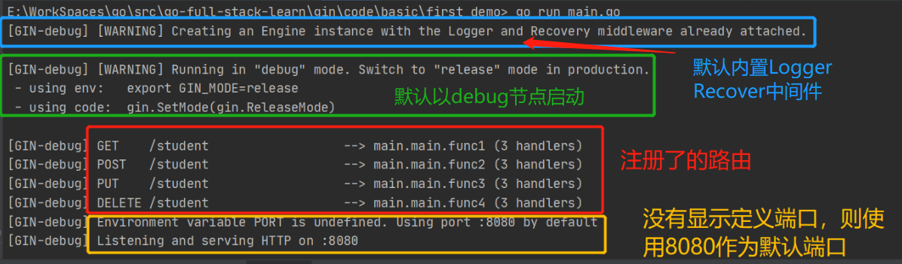

# Gin安装及初步使用

## 一.安装

运行以下命令即可：
```go
go get "github.com/gin-gonic/gin"
```
## 二.初步使用
[完整代码](../../code/basic/first_demo/main.go)

### 1.创建路由引擎并启动服务
**知识点；**

- `gin.Default()` 创建一个默认的路由引擎，内置了 Logger、Recovery 中间件
- `r.Run()` 启动HTTP服务，默认在127.0.0.1:8080启动服务，且是以 `debug` 节点启动。具体可以设置
  
**示例：**
```go
package main

import (
	"github.com/gin-gonic/gin"
)

func main() {
    r := gin.Default()

    // do something

	r.Run()
}
```

### 2.REST 风格API定义

**知识点：**

- `gin.Context` 上下文的封装，是gin最重要的部分。 它允许我们在中间件之间传递变量，管理流程，验证请求的JSON并呈现JSON响应。

- `r.GET/POST/PUT/DELETE()` 表示以**REST风格**（只列了常用4种）注册路由，其参数为 (relativePath,...HandlerFunc)。当客户端以 `GET/POST/PUT/DELETE` 方式请求 `relativePath` 路径时，会执行后面的匿名函数 `HandlerFunc`(该参数可以是多个，动态参数)
  
- `c.String()` 表示将给定的字符串写入响应主体，其参数为(code int,format string,values ...interface{})
  
- `c.JSON()` 表示将给定结构作为JSON序列化到响应主体中，其参数为 (code int,obj interface{})
  
- `gin.H{}` 表示以json的格式处理数据，底层是  map[string]interface{}

**示例：**
```go
r.GET("/student", func(c *gin.Context) {
    c.String(http.StatusOK, "使用String()做出响应:%s", "GET 请求..")
})

r.POST("/student", func(c *gin.Context) {

    c.JSON(http.StatusOK, gin.H{
        "message": "add request success",
    })
})

r.PUT("/student", func(c *gin.Context) {
    c.JSON(http.StatusOK, gin.H{
        "message": "update request success",
    })
})

r.DELETE("/student", func(c *gin.Context) {
    c.JSON(http.StatusOK, gin.H{
        "message": "delete request success",
    })

})
```

### 3.运行程序

将上面示例代码合并后，运行程序，可以看到控制台输出的日志，如下图：



gin的日志打印会将请求方式，请求路径，监听的端口都输出。