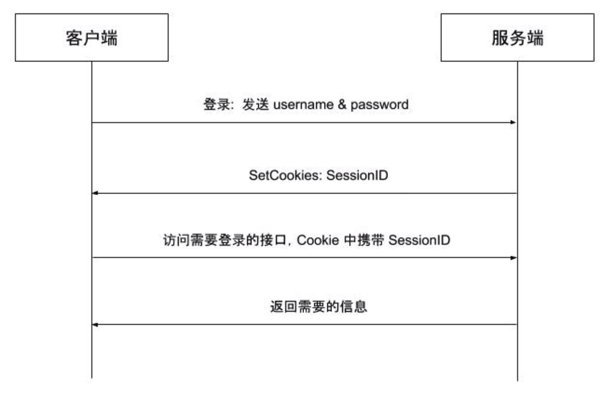
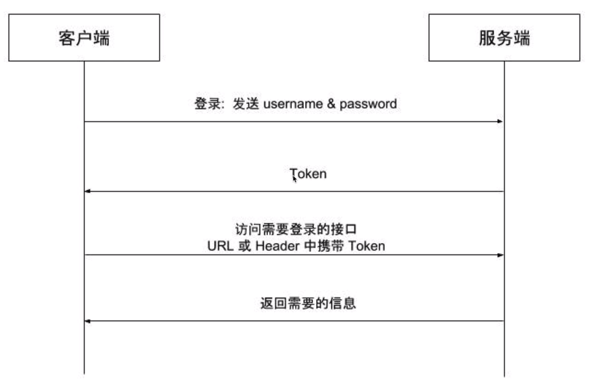

# 用户认证
`HTTP`是一个无状态的协议，一次请求结束后，下次在发送服务器就不知道这个请求是谁发来的了（同
一个IP不代表同一个用户）,在Web应用中，用户的认证和鉴权是非常重要的一环，实践中有多种可
用方案，并且各有千秋。
## Cookie-Session认证模式
在Web应用发展的初期，大部分采用基于`Cookie-Session`的会话管理方式，逻辑如下。
- 客户端使用用户名、密码进行认证
- 服务端验证用户名、密码正确后生成并存储`Session`,将`SessionID`通过`Cookie`返回给客户端
- 客户端访问需要认证的接口时在`Cookie`中携带`SessionID`
- 服务端通过`SessionID`查找`Session`并进行鉴权，返回给客户端需要的数据

如图：



基于Session的方式存在多种问题。
- 服务端需要存储`Session`,并且由于`Session`需要经常快速查找，通常存储在内存或内存数据库
中，同时在线用户较多时需要占用大量的服务器资源。
- 当需要扩展时，创建`Session`的服务器可能不是验证`Session`的服务器，所以还需要将所有
`Session` 单独存储并共享。
- 由于客户端使用`Cookie`存储SessionID,在跨域场景下需要进行兼容性处理，同时这种方式也难以防范CSRF攻击。
## Token认证模式
鉴于基于`Session`的会话管理方式存在上述多个缺点，基于Token的无状态会话管理方式诞生了，所谓无状态，就是服务端可以不再存储信息，甚至是不再存储`Session`,逻辑如下。
- 客户端使用用户名、密码进行认证
- 服务端验证用户名、密码正确后生成`Token`返回给客户端
- 客户端保存`Token`,访问需要认证的接口时在`URL`参数或`HTTPHeader`中加入`Token`
- 服务端通过解码`Token`进行鉴权，返回给客户端需要的数据

如图：



基于`Token`的会话管理方式有效解决了基于`Session`的会话管理方式带来的问题:
- 服务端不需要存储和用户鉴权有关的信息，鉴权信息会被加密到`Token`中，服务端只需要读取
`Token`中包含的鉴权信息即可
- 避免了共享`Session`导致的不易扩展问题
- 不需要依赖`Cookie`,有效避免`Cookie`带来的CSRF攻击问题
- 使用CORS可以快速解决跨域问题
## JWT介绍
JWT是JSON Web `Token`的缩写，是为了在网络应用环境间传递声明而执行的一种基于JSON的开放标
准（(RFC 7519)。JWT本身没有定义任何技术实现，它只是定义了一种基于`Token`的会话管理的规则，
涵盖`Token`需要包含的标准内容和`Token`的生成过程，特别适用于分布式站点的单点登录(`SSO`)场
景。

一个`JWT Token`就像这样：
> eyJhbGciOiJIUzI1NiIsInR5cCI6IkpXVCJ9.eyJ1c2VyX21kIjoyODAxODcyNzQ40DMyMzU4NSwiz
XhwI joxNTkONTQwMjkxLCJpc3MiOiJibHV1YmVsbCJ9.1k_ZrAtYGCeZhK3iupHxP1kgjBJzQTVTtX
0iZYFx9wU

它是由`.`分隔的三部分组成，这三部分依次是：
- 头部(Header)
- 负载(Payload)

- 签名(Signature)
- 
头部和负载以JSON形式存在，这就是`JWT`中的JSON,三部分的内容都分别单独经过了`Base64`编
码，以`.`拼接成一个`JWT Token`。

`JSON Web Token`的结构:


具体看一下每一部分：
### Header
`header`典型的由两部分组成：**token的类型**（“JWT”）和**算法名称**（比如：HMAC SHA256或者RSA等等）。

例如：


然后，用Base64对这个JSON编码就得到JWT的第一部分

 

### Payload
JWT的第二部分是`payload`，也是一个JSON对象，它包含声明（要求）。声明是关于实体(通常是用户)和其他数据的声明。声明有三种类型: `registered`, `public` 和 `private`。

- `Registered claims` : 这里有一组预定义的声明，它们不是强制的，但是推荐。比如：
    - iss(issuer):签发人
    - exp(expiration time):过期时间
    - sub(subject):主题
    - aud(audience):受众
    - nbf(Not Before):生效时间
    - iat(IssuedAt):签发时间
    - jti (JWT ID):编号

- `Public claims` : 除了官方字段，开发者也可以自定义指定字段和内容。
- `Private claims` : 用于在同意使用它们的各方之间共享信息，并且不是注册的或公开的声明。
下面是一个例子：


对`payload`进行`Base64`编码就得到JWT的第二部分

**注意：**不要在JWT的`payload`或`header`中放置敏感信息，除非它们是加密的。

 
### Signature
该部分是对前两部分的签名，防止数据被篡改。因此为了得到签名，你必须有编码过的`header`、编码过的`payload`、一个秘钥，签名算法是`header`中指定的那个，然对它们签名即可。 

例如：
> HMACSHA256(base64UrlEncode(header) + "." + base64UrlEncode(payload), secret)

签名是用于验证消息在传递过程中有没有被更改，并且，对于使用私钥签名的token，它还可以验证JWT的发送方是否为它所称的发送方。

看一张官网的图就明白了：


### JSON Web Tokens是如何工作的
1. 应用（或者客户端）想授权服务器请求授权。例如，如果用授权码流程的话，就是`/oauth/authorize`
2. 当授权被许可以后，授权服务器返回一个access token给应用
3. 应用使用access token访问受保护的资源（比如：API）


### JWT优缺点
- `JWT`拥有基于Token的会话管理方式所拥有的一切优势，不依赖`Cookie`,使得其可以防止CSRF攻
击，也能在禁用`Cookie`的浏览器环境中正常运行。

- 而`JWT`的最大优势是服务端不再需要存储`Session`,使得服务端认证鉴权业务可以方便扩展，避免存储
`Session`所需要引入的`Redis`等组件，降低了系统架构复杂度。但这也是`JWT`最大的劣势，由于有效期
存储在Token中，`JWT Token`一旦签发，就会在有效期内一直可用，无法在服务端废止，当用户进行登
出操作，只能依赖客户端删除掉本地存储的`JWT Token`,如果需要禁用用户，单纯使用`JWT`就无法做到
了。
## gin集成JWT

#### JWT工具类
**生成Token：**
```go
const (
    TokenExpireDuration = time.Minute * 10 // 过期时间
    MySecret    = "gin.jwt.study"          // 自定义
)

type MyClaims struct {
	UserID int64 `json:"userID"`
	jwt.StandardClaims
}

// GenToken 生成token
func GenToken(userID int64) (string, error) {
	// 创建一个我们自己的声明
	c := &MyClaims{
		userID,
		jwt.StandardClaims{
			ExpiresAt: time.Now().Add(TokenExpireDuration).Unix(), // 过期时间
			Issuer:    "XS-bbs",                                   // 签发人
		},
	}
	// 使用指定的签名方法创建签名对象
	token := jwt.NewWithClaims(jwt.SigningMethodHS256, c)
	// 使用指定的secret签名，注意转换为字节切片，并获得完整的编码后的字符串token
	return token.SignedString([]byte(MySecret))
}


```
**解析token并验证正确性：**
```go
// ParseToken 解析JWT
func ParseToken(tokenString string) (*MyClaims, error) {
	// 解析token
	var mc = new(MyClaims)
	token, err := jwt.ParseWithClaims(tokenString, mc, func(token *jwt.Token) (i interface{}, err error) {
		return MySecret, nil
	})
	if err != nil {
		return nil, err
	}
	if token.Valid { // 校验token
		return mc, nil
	}
	return nil, errors.New("invalid token")
}
```

#### 如何使用
实现一个基于gin的检验Token的中间件，代码实例：
```go
//  JWTAuthMiddleware 基于JWT的认证中间件
func JWTAuthMiddleware() func(c *gin.Context) {
	return func(c *gin.Context) {
		// 客户端携带Token有三种方式 1.放在请求头 2.放在请求体 3.放在URI
		// 这里假设Token放在Header的Authorization中，并使用Bearer开头
		// 这里的具体实现方式要依据你的实际业务情况决定
		authHeader := c.Request.Header.Get("Authorization")
		if authHeader == "" {
			c.JSON(http.StatusOK, gin.H{
				"code": 2003,
				"msg":  "请求头中auth为空",
			})
			c.Abort()
			return
		}
		// 按空格分割
		parts := strings.SplitN(authHeader, " ", 2)
		if !(len(parts) == 2 && parts[0] == "Bearer") {
			c.JSON(http.StatusOK, gin.H{
				"code": 2004,
				"msg":  "请求头中auth格式有误",
			})
			c.Abort()
			return
		}
		// parts[1]是获取到的tokenString，我们使用之前定义好的解析JWT的函数来解析它
		mc, err := ParseToken(parts[1])
		if err != nil {
			c.JSON(http.StatusOK, gin.H{
				"code": 2005,
				"msg":  "无效的Token",
			})
			c.Abort()
			return
		}
		// 将当前请求的username信息保存到请求的上下文c上
		c.Set("username", mc.Username)
		c.Next() // 后续的处理函数可以用过c.Get("username")来获取当前请求的用户信息
	}
}
```

## Refresh Token使用
前面讲的Token,都是`Access Token`,也就是访问资源接口时所需要的Token,还有另外一种
Token, `Refresh Token`,通常情况下，`Refresh Token`的有效期会比较长，而`Access Token`的有效期
比较短，当`Access Token`由于过期而失效时，使用`Refresh Token`就可以获取到新的`Access Token`,
如果`Refresh Token`也失效了，用户就只能重新登录了。

在JWT的实践中，引入`Refresh Token`,将会话管理流程改进如下。
- 客户端使用用户名密码进行认证
- 服务端生成有效时间较短的`Access Token`(例如10分钟）,和有效时间较长的Refresh
Token(例如7天）
- 客户端访问需要认证的接口时，携带`Access Token`
- 如果`Access Token`没有过期，服务端鉴权后返回给客户端需要的数据
- 如果携带`Access Token`访问需要认证的接口时鉴权失败（例如返回401错误）,则客户端使用
`Refresh Token`向刷新接口申请新的`Access Token`
- 如果`Refresh Token`没有过期，服务端向客户端下发新的`Access Token`
- 客户端使用新的`Access Token`访问需要认证的接口
  
用户登录过后会获得`access Token`与`refresh Token`（都有过期时间），`access Token`用于请求验明身份，`refresh Token`用户在`access Token`过期后重新获取新的`access Token`，并在此时更新自己的过期时间。如果用户长时间没有操作，那么`access Token`也将过期，用户需要重新登录。

`refresh Token`的意义在于更新`access Token`。一个用户的`access Token`被偷走，如果接口有数字签名那么小偷依然无法通过验证，如果接口没有数字签名，小偷可以在该`access Token`的有效期内进行冒牌访问。

实现代码：[refresh_token.go](../../code/advanced/jwt/refresh_token.go)