# 关于 MongoDB

## 初识 MongoDB

| Q                   | A                                                                                   |
| :------------------ | :---------------------------------------------------------------------------------- |
| 什么是 MongoDB      | 一个以 JSON 为数据模型的文档数据库                                                  |
| 为什么叫文档数据库? | 文档来自于“ JSON Document",并非我们一般理解的 PDF,WORD                              |
| 谁开发 Mong DB?     | 上市公司 MongoDB Inc.,总部位于美国纽约。                                            |
| 主要用途            | 应用数据库,类似于 Oracle, MySQL；可用于海量数据处理,数据平台                        |
| 主要特点            | 建模为可选；JSON 数据模型比较适合开发者；横向扩展可以支撑很大数据量和并发；支持事务 |
| MongoDB 是免费的吗? | MongoDB 有两个发布版本:社区版和企业版。社区版免费，企业版需付费                     |

## 与关系型数据库比较

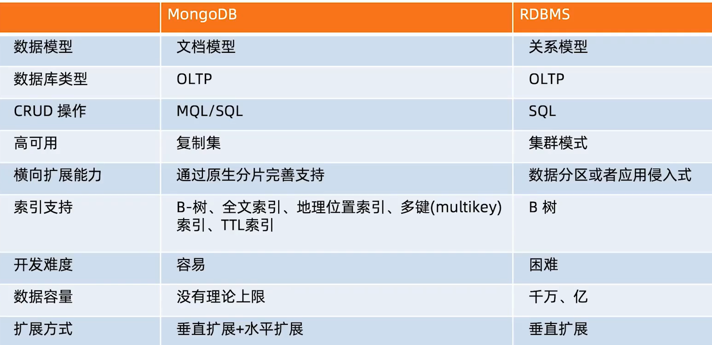

## 优势

### MongoDB 优势:面向开发者的易用+高效数据库

- 简单直观:以自然的方式来建模,以直观的方式来与数据库交互，直观的对象模型
  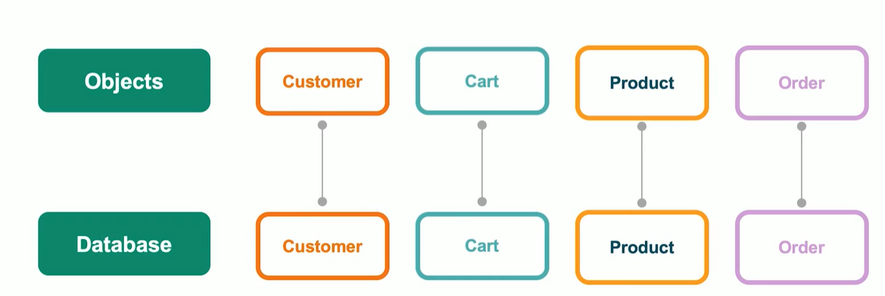
- 结构灵活：弹性模式从容响应需求的频繁变化
  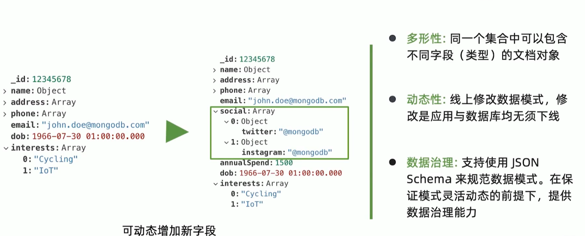

1. 动态性：对于传统关系型数据库模型，如果因业务需求要增加字段，修改后应用和数据库都得下线(或者通过命令新增字段，前提是有自研的 DBA 管理平台)-》再上线。而 MongoDB 则不需要此操作，业务层新增字段后，直接发布即可，不会操作数据库这一层，动态增加字段
2. 通过 Json Schema 来规范数据模式，可以选择性的增加一些表的限制来保证表中的数据是按照某种规则落库的。

- 快速开发:做更多的事,写更少的代码；JSON API 编写非常方便
  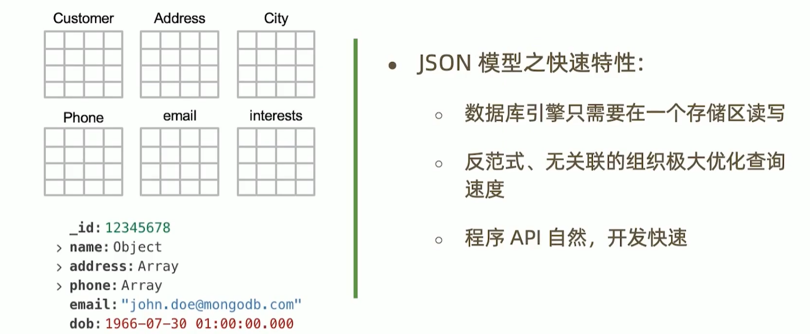

如图，如果在关系型数据模式下，需要建 6 张表来存储数据，比如某个用户的地址、手机号、所在城市等发生改变，那么新旧这些信息需要存下来。所以在业务在查数据库的时候，常会涉及到多个表，那么在机械硬盘的上 seek time(定位时间)就会增加，查询较慢，性能降低，一般来讲，定位时间:读写时间 = 95%:5%。但更重要的是，如果多表查询，需要开发者写合适的关联查询语句，如果经验不足，写出的语句都存在问题，不仅耗时还低效，因此才会很多面试问 sql 优化的问题。

如果使用 MongoDB：

- 上述信息只需要在一个存储区读写，大大减少了 seek time，提升查询速度和性能
- 不用写关联查询，因为数据都在一个数据集中存储
- 另外不用专门费心费力的去写关联查询 sql，MongoDB 提供了很多 API，符合开发者的习惯，开发快速

### MongoDB 原生的高可用和横向扩展能力

**原生高可用：**
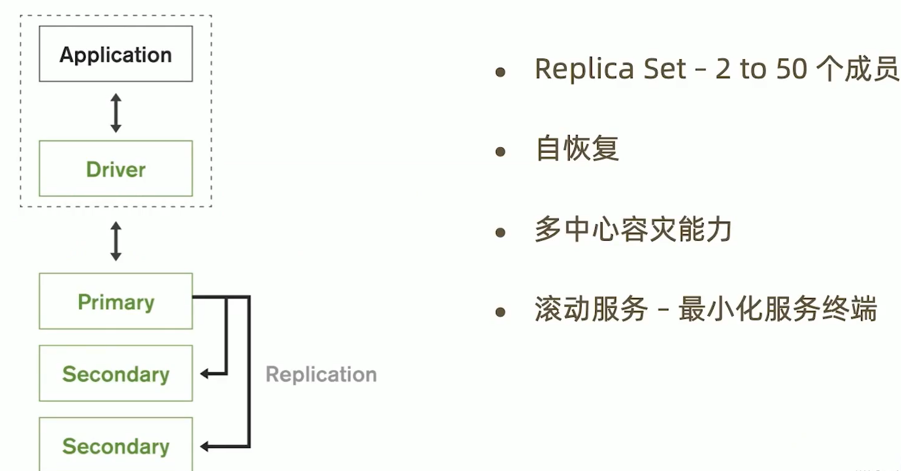

部署的时候，最佳实践是 3 个以上的节点，并且是奇数(投票机制)。图中：

- Driver 是 MongoDB 提供的类似于 JDBC 的模块，随着应用程序的运行，其便随之启动。通过 Driver，应用程序连接到 MongoDB 的主节点进行相应的读写操作(默认连接主节点(Primary))
- Primary 主节点，MongoDB 启动后的节点之一
- Secondary 两个从节点，MongoDB 提供自恢复机制，目的是主节点挂了之后可以使用从节点并取代已挂了的主节点的地位，保证应用正常运行。
- 多中心容灾能力 对于多中心部署场景，MongoDB 可以通过复制集机制保证其他地方的数据被另一个地方的服务器使用(数据复制)
- 滚动服务——最小化服务终端 正在运行的服务不用下线也能迭代版本

**原生支持横向扩展：**
通过分片集群来支持横向扩展：

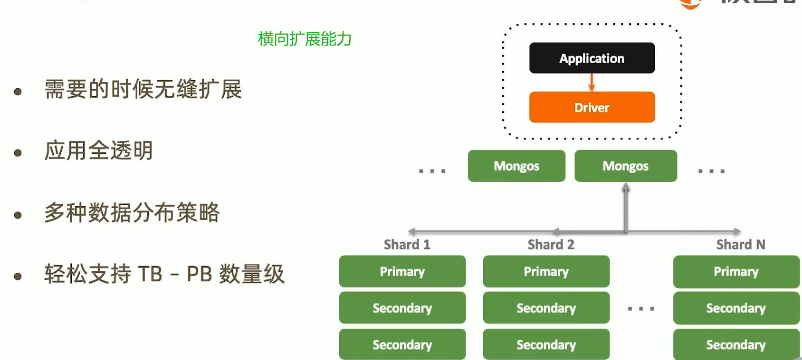

分片架构支持海量数据和无缝扩容，并且扩容时应用是无感知的。

# MongoDB 安装

## Docker 安装

[参考](https://www.jianshu.com/p/2181b2e27021)

### 1.下载 mongo 官方镜像到服务器上

```sh
docker pull mongo
```

默认下载最新版本

### 2.耐心等待下载完成，输入命令查看下载完成的镜像

```sh
docker images
```

### 3.启动 MongoDB 容器

镜像下载完成，下面就要开始启动容器了。启动容器前，建议大家仔细阅读前面寻找镜像时 [Docker Hub](https://hub.docker.com/_/mongo/) 上关于 mongo 镜像的详细说明。

在镜像文档里，我们知道了该镜像映射的端口号是 `27017`，配置文件的位置在 `/data/configdb`，数据库文件的位置在`/data/db`。

我们输入如下命令来启动容器。

```sh
docker run -d -p 27017:27017
-v /mydata/mongodb/conf:/data/configdb
-v /mydata/mongodb/data:/data/db
--name mongo docker.io/mongo

```

-v 两参数，主要是将 Linux 中的 MongoDB 配置和数据存储路径和 MongoDB 容器的配置等路径做了映射，这样直接访问 Linux 下的相关配置和 data 就相当于访问 docker 容器中的内容了

### 4.验证 MongoDB 容器是否启动成功

命令执行完后，输入命令 `docker ps` 来查看所有的容器，如果显示 mongo 则表示已经成功启动。

### 5.进入 MongoDB 容器

```sh
docker exec -it mongo mongo
```

可以使用 `show dbs` 查看有哪些数据库

输出：

> admin 0.000GB

> config 0.000GB

> local 0.000GB

## 官方可视化软件 Compass

官网菜单栏中 **software** 项有该应用，可以下载安装。只需要修改安装路径即可，其他一路 next。

## MongoDB 官网提供的免费的 MongoDB 云服务

### 1.官方首页选择 start free

点击图中按钮，会跳转到注册页，注册一个账号就能使用云服务了：
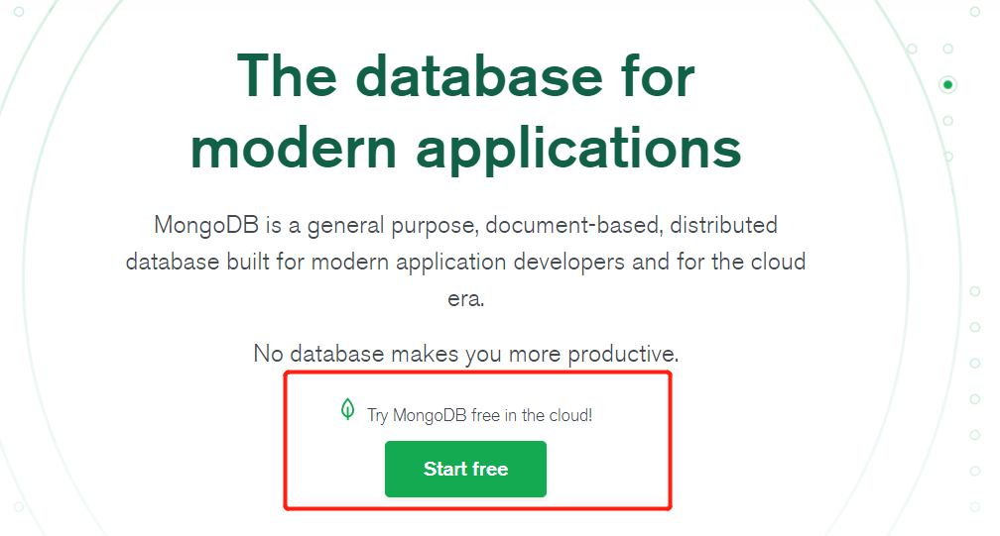

### 2.创建 cluster

点击页面中的 **Build a Cluster**，选择最左侧免费的。

设置好有云厂商和服务器所属区域，剩下的都默认，如图：
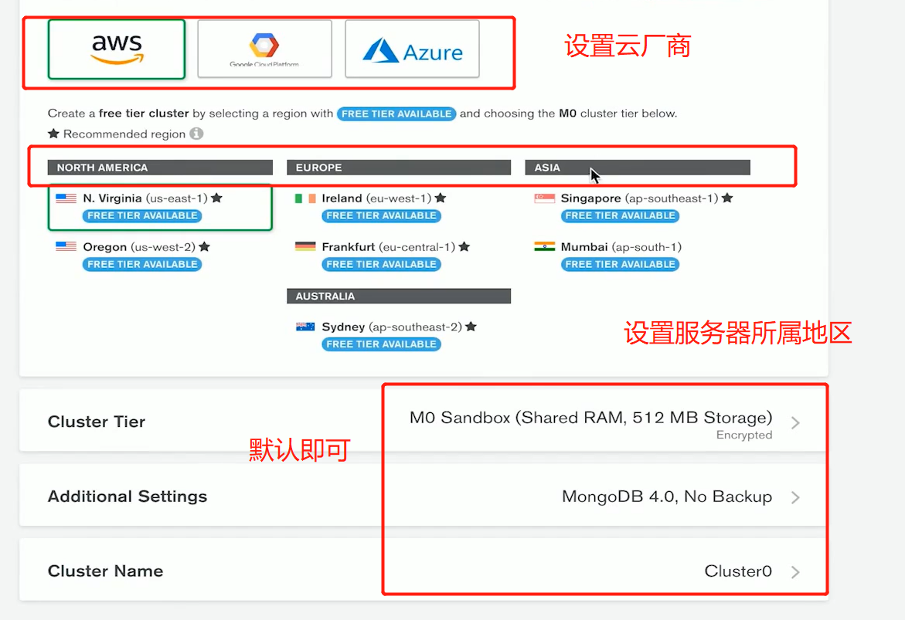

耐心等待一会，网速慢的可能需要多等一会。

### 3.创建连接

等 cluster 创建完成后，选择图中的 **CONNECT** 创建 MongoDB 连接：

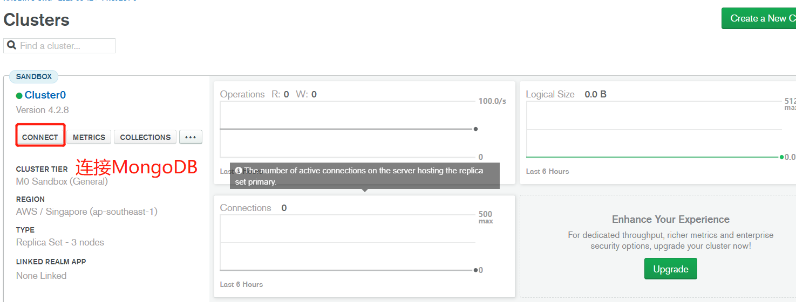

然后依次设置：

1. 点击 **Add your curent IP address** 使用你当前的 IP 地址
2. 在显示的新页面中点击 **Add IP address**
3. 点击右下角 **Choose a connect method**，先设置用户名和密码，保证别人无法通过你的 IP 直接访问 MongoDB 云服务，必须提供用户名和密码
4. 设置完用户名和密码后，会让你选择连接方式，这里推荐使用最后一个 **Connect using MongoDB compass**，其是使用一个 GUI MongoDB 客户端 Compass 来连接。
5. 然后选择 **I have MongoDB Compass**，复制生成的命令 `mongodb+srv://username:<password>@cluster0.rhd4p.mongodb.net/test` ，并将 `<password>` 修改为自己的密码
   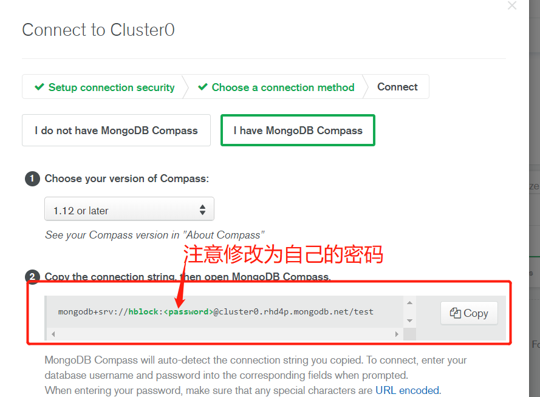
6. 启动安装好的 **Compass** ，在显示页填入刚刚复制的连接，注意账号和密码的格式
   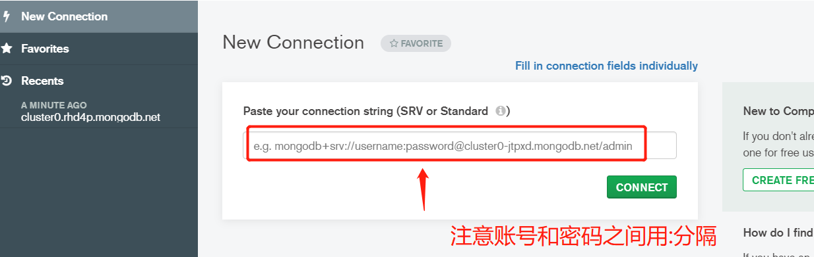

如果想修改连接方式，可以直接去自己的 MongoDB 云服务页面，再次点击 **CONNECT**按钮，在弹出的页面中选择相应连接方式来设置。

上述方式是通过 URL 来连接，**Compass**也提供 **IP+端口** 方式连接，图中输入框右上角有 **Fill in connection fields individually**，点击后即显示 IP+端口 连接页面

如果要新建一个 MongoDB 连接，按快捷键 `ctrl + n` 即可，会重新启动一个新的 compass 客户端
