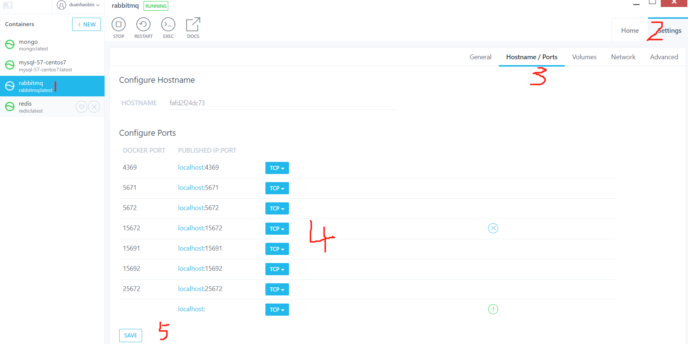

# 初识

# docker 命令安装 rabbitMQ

## 安装

1. 先创建一个目录用来专门存放 mq 对应的数据

```sh
mkdir

```

2. 获取 rabbit 镜像，默认下载最新版本：

```
docker pull rabbitmq:management
```

1. 执行以下命令：

```sh
docker run -d
--hostname rabbit-server
--name myrabbit
-v /mydata/rabbitmq:/var/lib/rabbitmq
-e RABBITMQ_DEFAULT_USER=admin
-e RABBITMQ_DEFAULT_PASS=admin
-p 15672:15672 -p 5672:5672 -p 25672:25672 -p 61613:61613 -p 1883:1883
rabbitmq:management
```

**命令解释：**

- docker run -d 以后台形式运行
- --hostname rabbit-server 设置 rabbitMQ 的主机名
- --name myrabbit 设置当前启动的容器的名字
- -v /mydata/rabbitmq:/var/lib/rabbitmq 挂载主机目录和 docker 容器目录
- -e RABBITMQ_DEFAULT_USER=admin 设置用户名，不设置默认是 guest
- -e RABBITMQ_DEFAULT_PASS=admin 设置密码，不设置默认是 guest
- -p 5672:5672 -p 15672:15672 -p 25672:25672 -p 61613:61613 -p 1883:1883 设置端口映射:5672->用于访问 API 的端口；15672->用于访问 rabbitMQ UI 管理界面端口；25672->用于集群节点之间通信的端口；
- rabbitmq:management 容器镜像源

## 验证是否安装成功

浏览器访问： `localhost:15672`，但是却无法访问，需要进行以下设置：

1. 确保 RabbitMQ 的端口等配置正确，进入 RabbitMQ 中，开启一项配置。

例：开启 RabbitMQ

```
docker run -itd --name myrabbitmq -p 15672:15672 -p 5672:5672 rabbitmq
```

2. 进入 RabbitMQ

```
docker exec -it myrabbitmq /bin/bash
```

3. 开启管理界面配置

```
rabbitmq-plugins enable rabbitmq_management
```

# 使用 docker Kitematic 终端界面安装 RabbitMQ

左上角点击 **+NEW** ，然后搜索 `rabbitmq`，安装官方版本即可。

安装完成后，需要设置端口，保证主机端口和容器端口是一致的，这样方便我们使用。

点击安装好的 rabbitmq 容器，然后选 `setting`-> `Hostname/Port`，将显示的端口设置一致，最后点保存(必须点，否则不生效)，保存后容器会自动启动。步骤如图：


