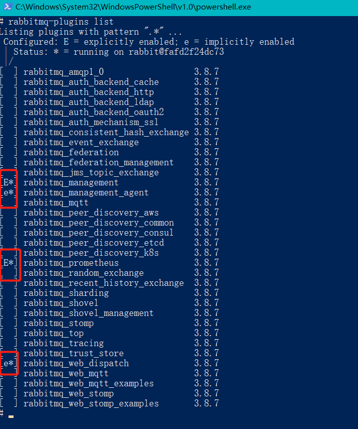

## 插件管理命令

**1.查看插件列表**

`rabbitmq-plugins list` ，图中红圈，中括号 `e*`的全称是 `enable`，表示该插件已启用



**2.启用插件**

`rabbitmq-plugins enable 插件名称`，已启动 `rabbitmq_management` 为例：

```
rabbitmq-plugins enable rabbitmq_management
```

**3.停用插件**

`rabbitmq-plugins disable 插件名称`，已启动 `rabbitmq_management` 为例：

```
rabbitmq-plugins disable rabbitmq_management
```
