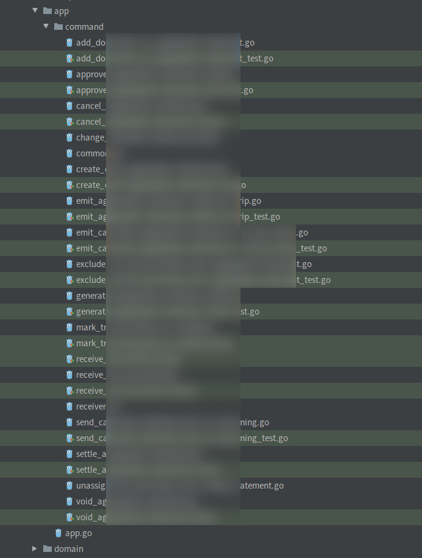
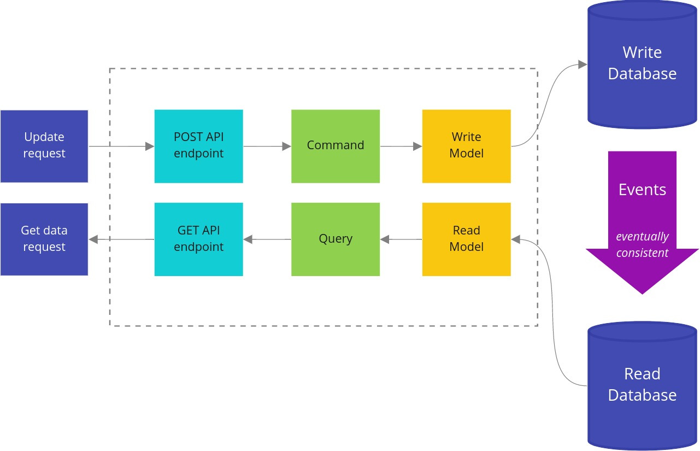

# Introducing basic CQRS by refactoring a Go project

翻译自:[https://threedots.tech/post/basic-cqrs-in-go/](https://threedots.tech/post/basic-cqrs-in-go/)

It’s highly likely you know at least one service that:
- has one big, unmaintainable model that is hard to understand and change,
- or where work in parallel on new features is limited,
- or can’t be scaled optimally.

你很可能知道至少有一种服务。
- 有一个大的、不可维护的模型，很难理解和改变。
- 或在新功能方面的并行工作受到限制。
- 或者不能以最佳方式进行扩展。

But often, bad things come in threes. It’s not uncommon to see services with all these problems.
但是，坏事往往是三倍于此的。具有所有这些问题的服务并不罕见。

What is an idea that comes to mind first for solving these issues? Let’s split it into more microservices!
要解决这些问题，首先想到的是什么想法？让我们把它分割成更多的微服务吧!

Unfortunately, without proper research and planning, the situation after blindly refactoring may be actually worse than before:
- **business logic and flow may become even harder to understand** – a complex logic is often easier to understand if it’s in one place,
- **distributed transactions** – things are sometimes together for a reason; a big transaction in one database is much faster and less complex than distributed transaction across multiple services,
- **adding new changes may require extra coordination,** if one of the services is owned by another team.

不幸的是，如果没有适当的研究和计划，盲目重构后的情况可能实际上比以前更糟：
- **业务逻辑和流程可能变得更加难以理解** - 一个复杂的逻辑如果在一个地方，往往更容易理解。
- **分布式事务**--事情有时在一起是有原因的；一个数据库中的大事务要比跨多个服务的分布式事务快得多，也不那么复杂。
- **增加新的变化可能需要额外的协调**，如果其中一个服务是由另一个团队拥有。

To be totally clear – I’m not an enemy of microservices. I’m just against blindly applying microservices in a way that introduces unneeded complexity and mess instead of making our lives easier.

要完全说清楚--我不是微服务的敌人。我只是反对盲目地应用微服务，因为这种方式会引入不必要的复杂性和混乱，而不是让我们的生活更轻松。

Another approach is using CQRS (Command Query Responsibility Segregation) with previously described Clean Architecture and DDD Lite. It can solve the mentioned problems in a much simpler way.

另一种方法是使用CQRS（命令查询责任隔离）与之前描述的清洁架构和DDD Lite。它能以更简单的方式解决上述问题。

## Isn’t CQRS a complex technique? CQRS 是一项很复杂的技术吗？
Isn’t CQRS one of these C#/Java/über enterprise patterns that are hard to implement, and make a big mess in the code? A lot of books, presentations, and articles describe CQRS as a very complicated pattern. But it is not the case.

CQRS不就是这些C#/Java/Uber企业模式中的一种，很难实现，而且在代码中搞得很乱吗？很多书、演讲和文章都把CQRS描述成一个非常复杂的模式。但事实并非如此。

In practice, CQRS is a very simple pattern that doesn’t require a lot of investment. It can be easily extended with more complex techniques like event-driven architecture, event-sourcing, or polyglot persistence. But they’re not always needed. Even without applying any extra patterns, CQRS can offer better decoupling, and code structure that is easier to understand.

在实践中，CQRS是一个非常简单的模式，不需要大量的投资。它可以很容易地用更复杂的技术进行扩展，比如事件驱动架构、事件源或多种持久性。但它们并不总是需要的。即使不应用任何额外的模式，CQRS也可以提供更好的解耦，以及更容易理解的代码结构。
> 多种持久化: 指一个应用中，为不同的数据存储需求，而采用多种数据存储技术。


When to not use CQRS in Go? How to get all benefits from CQRS? You can learn all that in today’s article. 😉

什么时候不在Go中使用CQRS？如何从CQRS中获得所有好处？你可以在今天的文章中了解所有这些。

Like always, I will do it by refactoring Wild Workouts application。

像往常一样，我将通过重构Wild Workouts应用程序来进行。
## How to implement basic CQRS in Go 如何在Go中实现基本的CQRS
CQRS (Command Query Responsibility Segregation) was initially described by Greg Young. It has one simple assumption: instead of having one big model for reads and writes, you should have two separate models. One for writes and one for reads. It also introduces concepts of command and query, and leads to splitting application services into two separate types: command and query handlers.

CQRS（命令查询责任隔离）最初是由Greg Young描述的。它有一个简单的假设：你应该有两个独立的模型，而不是为读和写建立一个大模型。一个用于写，一个用于读。它还引入了命令和查询的概念，并导致将应用服务分割成两个独立的类型：命令和查询处理程序。


### Command vs Query 命令与查询
In simplest words: a Query should not modify anything, just return the data. A command is the opposite one: it should make changes in the system, but not return any data. Thanks to that, our queries can be cached more efficiently, and we lower the complexity of commands.
用最简单的话来说：一个查询不应该修改任何东西，只是返回数据。命令则相反：它应该对系统进行修改，但不返回任何数据。正因为如此，我们的查询可以更有效地被缓存，我们也降低了命令的复杂性。

It may sound like a serious constraint, but in practice, it is not. Most of the operations that we execute are reads or writes. Very rarely, both.
这听起来像是一个严重的约束，但在实践中，它并不是。我们执行的大多数操作都是读或写。很少需要二者同时处理的情况。

Of course, for a query, we don’t consider side effects like logs, or metrics as modifying anything. For commands, it is also a perfectly normal thing to return an error.
当然，对于一个查询来说，我们不考虑像日志这样的副作用，也不考虑度量的修改。对于命令来说，返回一个错误也是非常正常的事情。

> As with most rules, it is ok to break them… as long as you perfectly understand why they were introduced and what tradeoffs you make. In practice, you rarely need to break these rules. I will share examples at the end of the article.

> 与大多数规则一样，打破它们是可以的......只要你完全理解为什么要引入这些规则，以及你做了哪些权衡。在实践中，你很少需要打破这些规则。我将在文章的最后分享一些例子。

How does the most basic implementation look in practice? In the previous article, Miłosz introduced an application service that executes application use cases. Let’s start by cutting this service into separate command and query handlers.

最基本的实现在实践中是怎样的？在上一篇文章中，Miłosz 介绍了一个执行应用程序用例的应用服务。让我们先把这个服务切割成独立的命令和查询处理程序。

### ApproveTrainingReschedule command  【审批培训重新安排】命令
Previously, the training reschedule was approved from the application service TrainingService.

以前，培训的重新安排是由应用服务TrainingService批准的。

```go
- func (c TrainingService) ApproveTrainingReschedule(ctx context.Context, user auth.User, trainingUUID string) error {
-  return c.repo.ApproveTrainingReschedule(ctx, trainingUUID, func(training Training) (Training, error) {
-     if training.ProposedTime == nil {
-        return Training{}, errors.New("training has no proposed time")
-     }
-     if training.MoveProposedBy == nil {
-        return Training{}, errors.New("training has no MoveProposedBy")
-     }
-     if *training.MoveProposedBy == "trainer" && training.UserUUID != user.UUID {
-        return Training{}, errors.Errorf("user '%s' cannot approve reschedule of user '%s'", user.UUID, training.UserUUID)
-     }
-     if *training.MoveProposedBy == user.Role {
-        return Training{}, errors.New("reschedule cannot be accepted by requesting person")
-     }
-
-     training.Time = *training.ProposedTime
-     training.ProposedTime = nil
-
-     return training, nil
-  })
- }
```
Full source: [github.com/ThreeDotsLabs/wild-workouts-go-ddd-example/commit/8d9274811559399461aa9f6bf3829316b8ddfb63#diff-ddf06fa26668dd91e829c7bfbd68feaeL127](https://github.com/ThreeDotsLabs/wild-workouts-go-ddd-example/commit/8d9274811559399461aa9f6bf3829316b8ddfb63#diff-ddf06fa26668dd91e829c7bfbd68feaeL127)

There were some magic validations there. They are now done in the domain layer. I also found out that we forgot to call the external trainer service to move the training. Oops. 😉 Let’s refactor it to the CQRS approach.

那里有一些神奇的验证。现在它们是在`domain`层中完成的。我还发现，我们忘了调用外部`trainer`服务来移动培训。哎呀！😉让我们按照CQRS的方法重构它。


> Because CQRS works best with applications following Domain-Driven Design, during refactoring towards CQRS I refactored existing models to DDD Lite as well. DDD Lite is described in more detail in the previous article.

> 因为CQRS在遵循领域驱动设计的应用中效果最好，在向CQRS重构的过程中，我也将现有模型重构为DDD Lite。DDD Lite在之前的文章中有更详细的描述。


We start the implementation of a command with the command structure definition. That structure provides all data needed to execute this command. If a command has only one field, you can skip the structure and just pass it as a parameter.

我们从命令结构的定义开始执行一个命令。该结构提供了执行该命令所需的所有数据。如果一个命令只有一个字段，你可以跳过这个结构，直接把它作为一个参数传递。

It’s a good idea to use types defined by domain in the command, like training.User in that case. We don’t need to do any casting later, and we have type safety assured. It can save us a lot of issues with string parameters passed in wrong order.

在命令中使用由`domain`层定义的类型是一个好主意，比如在这种情况下使用`training.User`。我们以后不需要做任何转换，而且我们有类型安全保证。这可以为我们省去很多以错误顺序传递的字符串参数的问题。
```go
package command

// ...

type ApproveTrainingReschedule struct {
   TrainingUUID string
   User         training.User
}
```
Full source: [github.com/ThreeDotsLabs/wild-workouts-go-ddd-example/internal/trainings/app/command/approve_training_reschedule.go](https://github.com/ThreeDotsLabs/wild-workouts-go-ddd-example/blob/22c0a25b67c4669d612a2fa4a434ffae8e35e65a/internal/trainings/app/command/approve_training_reschedule.go#L10)

The second part is a command handler that knows how to execute the command.
```go
package command

// ...

type ApproveTrainingRescheduleHandler struct {
   repo           training.Repository
   userService    UserService
   trainerService TrainerService
}

// ...

func (h ApproveTrainingRescheduleHandler) Handle(ctx context.Context, cmd ApproveTrainingReschedule) (err error) {
	defer func() {
		logs.LogCommandExecution("ApproveTrainingReschedule", cmd, err)
	}()

	return h.repo.UpdateTraining(
		ctx,
		cmd.TrainingUUID,
		cmd.User,
		func(ctx context.Context, tr *training.Training) (*training.Training, error) {
			originalTrainingTime := tr.Time()

			if err := tr.ApproveReschedule(cmd.User.Type()); err != nil {
				return nil, err
			}

			err := h.trainerService.MoveTraining(ctx, tr.Time(), originalTrainingTime)
			if err != nil {
				return nil, err
			}

			return tr, nil
		},
	)
}
```
Full source: [github.com/ThreeDotsLabs/wild-workouts-go-ddd-example/internal/trainings/app/command/approve_training_reschedule.go](https://github.com/ThreeDotsLabs/wild-workouts-go-ddd-example/blob/22c0a25b67c4669d612a2fa4a434ffae8e35e65a/internal/trainings/app/command/approve_training_reschedule.go#L39)

The flow is much easier to understand now. You can clearly see that we approve a reschedule of a persisted *training.Training, and if it succeeds, we call the external trainer service. Thanks to techniques described in the DDD Lite article, the command handler doesn’t need to know when it can perform this operation. It’s all handled by our domain layer.

现在的流程更容易理解了。你可以清楚地看到，我们批准对持久化的`*training.Training`进行重新安排，如果成功了，我们就会调用外部培训师服务。感谢`DDD Lite`文章中描述的技术，命令处理程序不需要知道它何时可以执行这个操作。这一切都由我们的领域(`domain`)层处理。

This clear flow is even more visible in more complex commands. Fortunately, the current implementation is really straightforward. That’s good. Our goal is not to create complicated, but simple software.

这种清晰的流程在更复杂的命令中更加明显。幸运的是，目前的实现确实很直接。这很好。我们的目标不是创造复杂的，而是简单的软件。

If CQRS is the standard way of building applications in your team, it also speeds up learning the service by your teammates who don’t know it. You just need a list of available commands and queries, and to quickly take a look at how their execution works. Jumping like crazy through random places in code is not needed.

如果CQRS是你的团队中构建应用程序的标准方式，它也会加速团队成员的学习速度，尤其是不了解业务的同学。你只需要一个可用的命令和查询的列表，并快速看一下它们的执行情况。不需要疯狂地跳过代码中的随机位置。


This is how it looks like in one of my team’s most complex services:

这就是我的团队中最复杂的一个服务:


You may ask - shouldn’t it be cut to multiple services? In practice, it would be a terrible idea. A lot of operations here need to be transitionally consistent. Splitting it to separate services would involve a couple of distributed transactions (Sagas). It would make this flow much more complex, harder to maintain, and debug. It’s not the best deal.

你可能会问--难道不应该削减到多种服务吗？在实践中，这将是一个糟糕的想法。这里的很多操作都需要过渡性的一致。把它分割成独立的服务会涉及到几个分布式事务(Sagas)。这将使这个流程更加复杂，更难维护和调试。这不是最好的交易。

It’s also worth mentioning that all of these operations are not very complex. Complexity is scaling horizontally excellently here. We will cover the extremely important topic of splitting microservices more in-depth soon. Did I already mention that we messed it up in Wild Workouts on purpose? 😉

还值得一提的是，所有这些操作都不是很复杂。复杂性在这里得到了出色的横向扩展。我们将在不久后更深入地讨论分割微服务这个极其重要的话题。我是不是已经说过，我们在`Wild Workouts`项目中故意把其搞得一团糟？ 😉

But let’s go back to our command. It’s time to use it in our HTTP port. It’s available in HttpServer via injected Application structure, which contains all of our commands and queries handlers.

但是，让我们回到我们的命令上。现在是在我们的`HTTP`端口中使用它的时候了。它在`HttpServer`中通过注入的`Application`结构可用，该`Application`包含了我们所有的命令和查询处理程序。

```go
package app

import (
   "github.com/ThreeDotsLabs/wild-workouts-go-ddd-example/internal/trainings/app/command"
   "github.com/ThreeDotsLabs/wild-workouts-go-ddd-example/internal/trainings/app/query"
)

type Application struct {
   Commands Commands
   Queries  Queries
}

type Commands struct {
   ApproveTrainingReschedule command.ApproveTrainingRescheduleHandler
   CancelTraining            command.CancelTrainingHandler
   // ...
```
Full source: [github.com/ThreeDotsLabs/wild-workouts-go-ddd-example/internal/trainings/app/app.go](https://github.com/ThreeDotsLabs/wild-workouts-go-ddd-example/blob/22c0a25b67c4669d612a2fa4a434ffae8e35e65a/internal/trainings/app/app.go#L8)

```go
type HttpServer struct {
   app app.Application
}

// ...

func (h HttpServer) ApproveRescheduleTraining(w http.ResponseWriter, r *http.Request) {
   trainingUUID := chi.URLParam(r, "trainingUUID")

   user, err := newDomainUserFromAuthUser(r.Context())
   if err != nil {
      httperr.RespondWithSlugError(err, w, r)
      return
   }

   err = h.app.Commands.ApproveTrainingReschedule.Handle(r.Context(), command.ApproveTrainingReschedule{
      User:         user,
      TrainingUUID: trainingUUID,
   })
   if err != nil {
      httperr.RespondWithSlugError(err, w, r)
      return
   }
}
```
Full source: [github.com/ThreeDotsLabs/wild-workouts-go-ddd-example/internal/trainings/ports/http.go](https://github.com/ThreeDotsLabs/wild-workouts-go-ddd-example/blob/22c0a25b67c4669d612a2fa4a434ffae8e35e65a/internal/trainings/ports/http.go#L160)

The command handler can be called in that way from any port: HTTP, gRPC, or CLI. It’s also useful for executing migrations and loading fixtures (we already do it in Wild Workouts).

命令处理程序可以以这种方式从任何端口调用。HTTP、gRPC、或CLI。它对于执行迁移和加载固定装置也很有用（我们已经在Wild Workouts中这样做了）。

### RequestTrainingReschedule command 请求训练重新调度服务 command 

Some command handlers can be very simple.

有些命令处理程序可以非常简单。
```go
func (h RequestTrainingRescheduleHandler) Handle(ctx context.Context, cmd RequestTrainingReschedule) (err error) {
	defer func() {
		logs.LogCommandExecution("RequestTrainingReschedule", cmd, err)
	}()

	return h.repo.UpdateTraining(
		ctx,
		cmd.TrainingUUID,
		cmd.User,
		func(ctx context.Context, tr *training.Training) (*training.Training, error) {
			if err := tr.UpdateNotes(cmd.NewNotes); err != nil {
				return nil, err
			}

			tr.ProposeReschedule(cmd.NewTime, cmd.User.Type())

			return tr, nil
		},
	)
}
```
Full source: [github.com/ThreeDotsLabs/wild-workouts-go-ddd-example/internal/trainings/app/command/request_training_reschedule.go](https://github.com/ThreeDotsLabs/wild-workouts-go-ddd-example/blob/22c0a25b67c4669d612a2fa4a434ffae8e35e65a/internal/trainings/app/command/request_training_reschedule.go#L32)

It may be tempting to skip this layer for such simple cases to save some boilerplate. It’s true, but you need to remember that writing code is always much cheaper than the maintenance. Adding this simple type is 3 minutes of work. People who will read and extend this code later will appreciate that effort.

在这种简单的情况下，跳过这一层，以节省一些模板，可能是很诱人的。这是真的，但你需要记住，写代码总是比维护要便宜得多。添加这个简单的类型只是3分钟的工作。那些以后会阅读和扩展这段代码的人将会感谢这种努力。
### AvailableHoursHandler query AvailableHoursHandler 查询
Queries in the application layer are usually pretty boring. In the most common case, we need to write a read model interface (AvailableHoursReadModel) that defines how we can query the data.

应用层的查询通常是很无聊的。在最常见的情况下，我们需要写一个读取模型的接口（AvailableHoursReadModel），定义我们如何查询数据。

Commands and queries are also a great place for all cross-cutting concerns, like logging and instrumentation. Thanks to putting that here, we are sure that performance is measured in the same way whether it’s called from HTTP or gRPC port.

命令和查询也是所有跨领域关注的一个好地方，比如日志和仪表。由于把这些放在这里，我们可以确定，无论从HTTP还是gRPC端口调用，性能的衡量方式都是一样的。

```go
package query

// ...

type AvailableHoursHandler struct {
	readModel AvailableHoursReadModel
}

type AvailableHoursReadModel interface {
	AvailableHours(ctx context.Context, from time.Time, to time.Time) ([]Date, error)
}

// ...

type AvailableHours struct {
	From time.Time
	To   time.Time
}

func (h AvailableHoursHandler) Handle(ctx context.Context, query AvailableHours) (d []Date, err error) {
	start := time.Now()
	defer func() {
		logrus.
			WithError(err).
			WithField("duration", time.Since(start)).
			Debug("AvailableHoursHandler executed")
	}()

	if query.From.After(query.To) {
		return nil, errors.NewIncorrectInputError("date-from-after-date-to", "Date from after date to")
	}

	return h.readModel.AvailableHours(ctx, query.From, query.To)
}
```
Full source: [github.com/ThreeDotsLabs/wild-workouts-go-ddd-example/internal/trainer/app/query/available_hours.go](https://github.com/ThreeDotsLabs/wild-workouts-go-ddd-example/blob/22c0a25b67c4669d612a2fa4a434ffae8e35e65a/internal/trainer/app/query/available_hours.go#L11)

We also need to define data types returned by the query. In our case, it’s query.Date.

我们还需要定义由查询返回的数据类型。在我们的例子中，它是query.Date。

```go
package query

import (
	"time"
)

type Date struct {
	Date         time.Time
	HasFreeHours bool
	Hours        []Hour
}

type Hour struct {
	Available            bool
	HasTrainingScheduled bool
	Hour                 time.Time
}
```
Full source: [github.com/ThreeDotsLabs/wild-workouts-go-ddd-example/internal/trainer/app/query/types.go](https://github.com/ThreeDotsLabs/wild-workouts-go-ddd-example/blob/22c0a25b67c4669d612a2fa4a434ffae8e35e65a/internal/trainer/app/query/types.go)

Our query model is more complex than the domain hour.Hour type. It’s a common scenario. Often, it’s driven by the UI of the website, and it’s more efficient to generate the most optimal responses on the backend side.

我们的查询模型比领域内的hour.Hour类型更复杂。这是一种常见的情况。通常情况下，它是由网站的用户界面驱动的，在后端生成最优化的响应会更有效率。

As the application grows, differences between domain and query models may become bigger. Thanks to the separation and decoupling, we can independently make changes in both of them. This is critical for keeping fast development in the long term.

随着应用程序的增长，领域和查询模型之间的差异可能会变得更大。由于分离和解耦，我们可以独立地对它们进行修改。这对于保持长期的快速发展至关重要。

```go
package hour

type Hour struct {
	hour time.Time

	availability Availability
```
Full source: [github.com/ThreeDotsLabs/wild-workouts-go-ddd-example/internal/trainer/domain/hour/hour.go](https://github.com/ThreeDotsLabs/wild-workouts-go-ddd-example/blob/22c0a25b67c4669d612a2fa4a434ffae8e35e65a/internal/trainer/domain/hour/hour.go#L11)

But from where AvailableHoursReadModel gets the data? For the application layer, it is fully transparent and not relevant. This allows us to add performance optimizations in the future, touching just one part of the application.

但是`AvailableHoursReadModel`从哪里获得数据？对于应用层来说，它是完全透明的，没有关系。这允许我们在未来增加性能优化，只触及应用程序的一个部分。

> If you are not familiar with the concept of _ports and adapters_, I highly recommend reading our [article about Clean Architecture in Go.](https://threedots.tech/post/introducing-clean-architecture/)

如果你不熟悉 端口和适配器的概念，我强烈建议你阅读我们关于Go中清洁架构的文章。

In practice, the current implementation gets the data from our write models database. You can find the [AllTrainings](https://github.com/ThreeDotsLabs/wild-workouts-go-ddd-example/blob/22c0a25b67c4669d612a2fa4a434ffae8e35e65a/internal/trainings/app/query/all_trainings.go#L19) read model [implementation](https://github.com/ThreeDotsLabs/wild-workouts-go-ddd-example/blob/22c0a25b67c4669d612a2fa4a434ffae8e35e65a/internal/trainings/adapters/trainings_firestore_repository.go#L170) and [tests](https://github.com/ThreeDotsLabs/wild-workouts-go-ddd-example/blob/22c0a25b67c4669d612a2fa4a434ffae8e35e65a/internal/trainings/adapters/trainings_firestore_repository_test.go#L152) for DatesFirestoreRepository in the adapters layer.

在实践中，目前的实现是从我们的写模型数据库中获取数据。你可以在适配器层找到AllTrainings读取模型的实现和DatesFirestoreRepository的测试。


> Data for our queries is currently queried from the same database where write models are stored.

> 目前，我们的查询数据是从存储写作模型的同一数据库中查询的。
 
If you read about CQRS earlier, it is often recommended to use a separate database built from events for queries. It may be a good idea, but in very specific cases. I will describe it in the Future optimizations section. In our case, it’s sufficient to just get data from the write models database.

如果你在前面读过关于CQRS的文章，通常建议使用一个由事件建立的独立数据库进行查询。这可能是一个好主意，但在非常特殊的情况下。我将在未来的优化部分描述它。在我们的案例中，只需要从写模型数据库中获取数据就足够了。

## HourAvailabilityHandler query HourAvailabilityHandler 查询
We don’t need to add a read model interface for every query. It’s also fine to use the domain repository and pick the data that we need.

我们不需要为每个查询添加一个读模型接口。使用领域资源库并挑选我们需要的数据也是可以的。

> PS: 这适用于简单的返回，如果返回值很复杂(需要定义结构体)，推荐是定义读模型接口
```go
import (
   "context"
   "time"

   "github.com/ThreeDotsLabs/wild-workouts-go-ddd-example/internal/trainer/domain/hour"
)

type HourAvailabilityHandler struct {
   hourRepo hour.Repository
}

func (h HourAvailabilityHandler) Handle(ctx context.Context, time time.Time) (bool, error) {
   hour, err := h.hourRepo.GetHour(ctx, time)
   if err != nil {
      return false, err
   }

   return hour.IsAvailable(), nil
}
```
Full source: [github.com/ThreeDotsLabs/wild-workouts-go-ddd-example/internal/trainer/app/query/hour_availability.go](https://github.com/ThreeDotsLabs/wild-workouts-go-ddd-example/blob/22c0a25b67c4669d612a2fa4a434ffae8e35e65a/internal/trainer/app/query/hour_availability.go#L22)

## Naming 命名
Naming is one of the most challenging and most essential parts of software development. In Introduction to DDD Lite article I described a rule that says you should stick to the language that is as close as it can be to how non-technical people (often referred to as “business”) talk. It also applies to Commands and Queries names.

命名是软件开发中最具挑战性和最重要的部分之一。在[《DDD Lite简介》](https://threedots.tech/post/ddd-lite-in-go-introduction/)一文中，我描述了一条规则，即你应该坚持使用尽可能接近非技术人员（通常被称为 "业务"）说话方式的语言。这也适用于命令和查询的名称。

You should avoid names like “Create training” or “Delete training”. **This is not how business and users understand your domain. You should instead use “Schedule training” and “Cancel training”.**

你应该避免使用 "创建培训 "或 "删除培训 "这样的名字。**这不是商业和用户理解你的领域的方式。你应该使用 "安排培训 "和 "取消培训 "**: 


We will cover this topic deeper in an article about Ubiquitous Language. Until then, just go to your business people and listen how they call operations. Think twice if any of your command names really need to start with “Create/Delete/Update”.

我们将在一篇关于泛在语言的文章中更深入地介绍这个话题。在那之前，只要去找你的业务人员，听听他们是如何调用操作的。如果你的任何命令名称真的需要以 "创建/删除/更新 "开头，请三思。

## Future optimizations 未来的优化
Basic CQRS gives some advantages like better code organisation, decoupling, and simplifying models. There is also one, even more important advantage. It is the ability to extend CQRS with more powerful and complex patterns.

基本的CQRS给出了一些优势，比如更好的代码组织，解耦，以及简化模型。还有一个更重要的优势。它就是用更强大和复杂的模式来扩展CQRS的能力。

### Async commands 异步命令
Some commands are slow by nature. They may be doing some external calls or some heavy computation. In that case, we can introduce Asynchronous Command Bus, which executes the command in the background.

有些命令本质上是很慢的。它们可能在做一些外部调用或一些繁重的计算。在这种情况下，我们可以引入异步命令总线，它在后台执行命令。

Using asynchronous commands has some additional infrastructure requirements, like having a queue or a pub/sub. Fortunately, the Watermill library can help you handle this in Go. You can find more details in the Watermill CQRS documentation. (BTW We are the authors of Watermill as well 😉 Feel free to contact us if something’s not clear there!)

使用异步命令有一些额外的基础设施要求，比如有一个队列或一个pub/sub。幸运的是，Watermill库可以帮助你在Go中处理这个问题。你可以在Watermill CQRS文档中找到更多细节。(BTW 我们也是Watermill的作者 😉 如果有什么不清楚的地方，请随时联系我们！)

### A separate database for queries 一个单独的数据库用于查询
Our current implementation uses the same database for reads (queries) and writes (commands). If we would need to provide more complex queries or have really fast reads, we could use the polyglot persistence technique. The idea is to duplicate queried data in a more optimal format in another database. For example, we could use Elastic to index some data that can be searched and filtered more easily.

我们目前的实现使用相同的数据库进行读取（查询）和写入（命令）。如果我们需要提供更复杂的查询或有真正快速的读取，我们可以使用多角化的持久化技术。这个想法是在另一个数据库中以更理想的格式复制被查询的数据。例如，我们可以使用Elastic来索引一些可以更容易搜索和过滤的数据。

Data synchronization, in this case, can be done via events. One of the most important implications of this approach is eventual consistency. You should ask yourself if it’s an acceptable tradeoff in your system. If you are not sure, you can just start without polyglot persistence and migrate later. It’s good to defer key decisions like this one.

数据同步，在这种情况下，可以通过事件来完成。这种方法最重要的影响之一是最终的一致性。你应该问问自己，在你的系统中，这是否是一个可以接受的权衡。如果你不确定，你可以先不使用多角化的持久化技术，以后再进行迁移。推迟像这样的关键决定是很好的。


An example implementation is described in the Watermill CQRS documentation as well. Maybe with time, we will introduce it also in Wild Workouts, who knows?

Watermill CQRS的文档中也描述了一个实现的例子。也许随着时间的推移，我们也会在Wild Workouts中介绍它，谁知道呢？



### Event-Sourcing 事件源
If you work in a domain with strict audit requirements, you should definitely check out the event sourcing technique. For example, I’m currently working in the financial domain, and event sourcing is our default persistence choice. It provides out-of-the-box audit and helps with reverting some bug implications.

如果你在一个有严格审计要求的领域工作，你肯定应该看看事件源技术。例如，我目前在金融领域工作，而事件源是我们默认的持久化选择。它提供了开箱即用的审计，并有助于恢复一些错误的影响。

CQRS is often described together with event sourcing. The reason is that by design in event-sourced systems, we don’t store the model in a format ready for reads (queries), but just a list of events used by writes (commands). In other words, it’s harder to provide any API responses.

CQRS经常与事件源一起被描述。原因是在事件源系统的设计中，我们并不是以准备好的格式来存储模型，而是仅仅存储一个写（命令）使用的事件列表，以供读取（查询）。换句话说，要提供任何API响应是比较困难的。

Thanks to the separation of command and query models, it’s not really a big problem. Our read models for queries live independently by design.

由于命令和查询模型的分离，这其实并不是一个大问题。我们的查询的读取模型在设计上是独立存在的。

There are also a lot more advantages of event sourcing, that are visible in a financial systems. But let’s leave it for another article. 😉 Until then, you can check the Ebook from Greg Young – Versioning in an Event Sourced System. The same Greg Young who described CQRS.

还有很多事件源的优点，在金融系统中是可以看到的。在那之前，你可以看看Greg Young的电子书--《事件源系统中的版本管理》。也就是描述CQRS的Greg Young。

## When to not use CQRS?
CQRS is not a silver bullet that fits everywhere perfectly. A good example is authorization. You provide a login and a password, and in return, you get confirmation if you succeeded and maybe some token.

CQRS不是一个完美地适合所有地方的银弹。一个很好的例子是授权。你提供一个登录名和密码，作为回报，你会得到确认，如果你成功了，也许还有一些令牌。


If your application is a simple CRUD that receives and returns the same data, it’s also not the best case for CQRS. That’s the reason why users microservice in Wild Workouts doesn’t use Clean Architecture and CQRS. In simple, data-oriented services, these patterns usually don’t make sense. On the other hand, you should keep an eye on services like that. If you notice the logic grows and development is painful, maybe it’s time for some refactoring?

如果你的应用程序是一个简单的CRUD，接收和返回相同的数据，这也不是CQRS的最佳案例。这就是为什么Wild Workouts中的用户微服务没有使用Clean Architecture和CQRS的原因。在简单的、面向数据的服务中，这些模式通常没有意义。另一方面，你应该密切关注这样的服务。如果你注意到逻辑的增长和开发是痛苦的，也许是时候进行一些重构了？

### Returning created entity via API with CQRS 用CQRS通过API返回创建的实体
I know that some people have a problem with using CQRS for the REST API that returns the created entity as the response of a POST request. Isn’t it against CQRS? Not really! You can solve it in two ways:

1. Call the command in the HTTP port and after it succeeds, call the query to get the data to return,
2. Instead of returning the created entity, return 204 HTTP code with header content-location set to the created resource URL.
  
我知道有些人对使用CQRS的REST API返回创建的实体作为POST请求的响应有意见。这不是违反CQRS吗？并非如此! 你可以通过两种方式来解决这个问题:
1. 在HTTP端口中调用命令，成功后，调用查询来获得要返回的数据。
2. 不返回创建的实体，而是返回204的HTTP代码，`HTTP`header中`content-location`设置为创建的资源URL。

The second approach is IMO better because it doesn’t require to always query for the created entity (even if the client doesn’t need this data). With the second approach, the client will only follow the link if it’s needed. It can also be cached with that call.

第二种方法是IMO更好的，因为它不需要总是查询创建的实体（即使客户端不需要这个数据）。使用第二种方法，客户端只会在需要的时候才会跟踪这个链接。它也可以通过该调用进行缓存。


The only question is how to get created entity’s ID? A common practice is to provide the UUID of the entity to be created in the command.

唯一的问题是如何获得创建的实体的ID？一个常见的做法是在命令中提供要创建的实体的UUID。

> 备注：在创建接口中，http header中设置 content-location，可以让客户端自动跳转到创建的资源)
> eg: w.Header().Set("content-location", "/trainings/"+cmd.TrainingUUID)

This approach’s advantage is that it will still work as expected if the command handler is asynchronous. In case you don’t want to work with UUIDs, as a last resort you can return the ID from the handler – it won’t be the end of the world. 😉

这种方法的优点是，如果命令处理程序是异步的，它仍然可以按预期工作。如果你不想使用UUID，作为最后的手段，你可以从处理程序中返回ID - 这不会是世界末日。

```go
cmd := command.ScheduleTraining{
    TrainingUUID: uuid.New().String(),
    UserUUID:     user.UUID,
    UserName:     user.DisplayName,
    TrainingTime: postTraining.Time,
    Notes:        postTraining.Notes,
}
err = h.app.Commands.ScheduleTraining.Handle(r.Context(), cmd)
if err != nil {
    httperr.RespondWithSlugError(err, w, r)
    return
}

w.Header().Set("content-location", "/trainings/" + cmd.TrainingUUID)
w.WriteHeader(http.StatusNoContent)
```
> Full source: [github.com/ThreeDotsLabs/wild-workouts-go-ddd-example/internal/trainings/ports/http.go](https://github.com/ThreeDotsLabs/wild-workouts-go-ddd-example/blob/22c0a25b67c4669d612a2fa4a434ffae8e35e65a/internal/trainings/ports/http.go#L70)
## You can now put CQRS in your resume! 你现在可以把CQRS写进你的简历了
We did it – we have a basic CQRS implementation in Wild Workouts. You should also have an idea of how you can extend the application in the future.

我们做到了--我们在Wild Workouts中有一个基本的CQRS实现。你也应该对未来如何扩展该应用有了一个想法。

While preparing the code for this article, I also refactored the trainer service towards DDD. I will cover this in the next article. Although the entire diff of that refactoring is already available on our GitHub repository.

在准备这篇文章的代码时，我还将培训师服务向DDD方向重构。我将在下一篇文章中介绍这一点。尽管整个重构的差异已经在我们的GitHub资源库中提供。

Having every command handler as a separate type also helps with testing, as it’s easier to build dependencies for them. This part is covered by Miłosz in Microservices Test Architecture.

将每个命令处理程序作为一个单独的类型也有助于测试，因为为它们建立依赖关系更加容易。这一部分由Miłosz在微服务测试架构中涵盖。

Are you using CQRS with any extensions? Do you have any project where you don’t know how to apply these patterns? Feel free to share and ask in the comments!

你在使用带有任何扩展的CQRS吗？你是否有任何项目不知道如何应用这些模式？欢迎在评论中分享和提问! 


