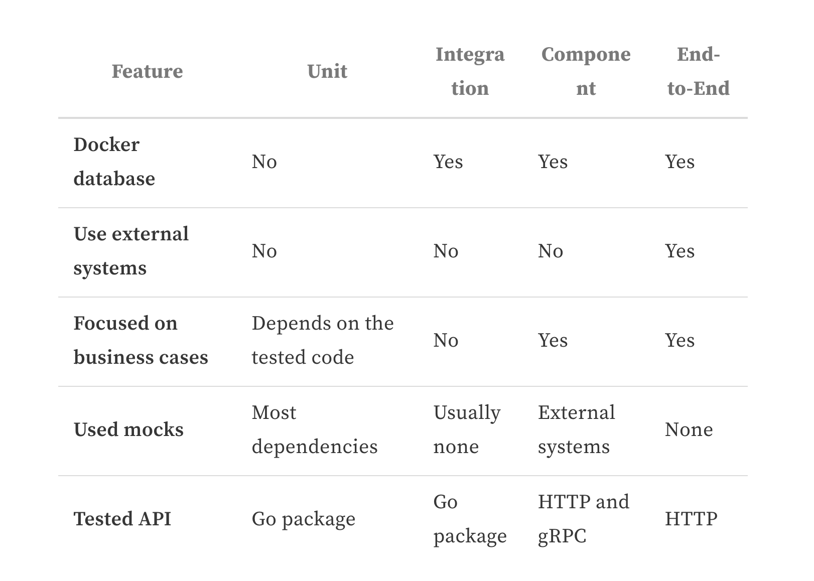

# Microservices test architecture. Can you sleep well without end-to-end tests?
微服务测试架构。没有端到端的测试，你能睡得好吗？

翻译自:[https://threedots.tech/post/microservices-test-architecture/)([翻译自:](https://threedots.tech/post/microservices-test-architecture/))


Do you know the rare feeling when you develop a new application from scratch and can cover all lines with proper tests?

你知道当你从头开始开发一个新的应用程序，并能用适当的测试覆盖所有的线路时，那种罕见的感觉吗？

I said “rare” because most of the time, you will work with software with a long history, multiple contributors, and not so obvious testing approach. Even if the code uses good patterns, the test suite doesn’t always follow.

我说 "罕见 "是因为在大多数情况下，你所工作的软件有很长的历史，有多个贡献者，而且测试方法不是那么明显。即使代码使用了好的模式，测试套件也不一定能跟上。

Some projects have no modern development environment set up, so there are only unit tests for things that are easy to test. For example, they test single functions separately because it’s hard to test the public API. The team needs to manually verify all changes, probably on some kind of staging environment. You know what happens when someone introduces changes and doesn’t know they need to test it manually.

有些项目没有建立现代的开发环境，所以只有一些容易测试的东西的单元测试。例如，他们单独测试单个函数，因为很难测试公共API。团队需要手动验证所有的变化，可能是在某种暂存环境上。你知道当有人引入变化而不知道他们需要手动测试时会发生什么。

Other projects have no tests from the beginning. It allows quicker development by taking shortcuts, for example, keeping dependencies in the global state. When the team realizes the lack of tests causes bugs and slows them down, they decide to add them. But now, it’s impossible to do it reasonably. So the team writes an end-to-end test suite with proper infrastructure in place.

其他项目从一开始就没有测试。它通过走捷径使开发速度加快，例如，将依赖关系保持在全局状态。当团队意识到缺乏测试会导致bug并减慢他们的速度时，他们决定增加测试。但现在，不可能合理地做到这一点。因此，团队写了一个端到端的测试套件，并建立了适当的基础设施。

End-to-end tests might give you some confidence, but you don’t want to maintain such a test suite. It’s hard to debug, takes a long time to test even the simplest change, and releasing the application takes hours. Introducing new tests is also not trivial in this scenario, so developers avoid it if they can.

端到端测试可能会给你一些信心，但你并不想维护这样的测试套件。它很难调试，即使是最简单的变化也要花很长时间来测试，而发布应用程序需要几个小时。在这种情况下，引入新的测试也不是小事，因此，如果可以的话，开发人员会避免这样做。


I want to introduce some ideas that have worked for us so far and should help you avoid the scenarios above.

我想介绍一些到目前为止对我们有效的想法，应该可以帮助你避免上述情况的发生。


This post is not about which testing library is best or what tricks you can use (although I will show a few tips). It’s closer to something I would call “test architecture”. It’s not only about “how”, but also “where”, “what”, and “why”.

这篇文章不是关于哪个测试库最好，或者你可以使用什么技巧（尽管我将展示一些技巧）。它更接近于我称之为 "测试架构"的东西。它不仅是关于 "如何"，而且还有 "哪里"、"什么 "和 "为什么"。

There’s been a lot of discussion on different types of tests, for example, the “test pyramid” (Robert mentioned it in this section about testing scenarios). It’s a helpful model to keep in mind. However, it’s also abstract, and you can’t easily measure it. I want to take a more practical approach and show how to introduce a few kinds of tests in a Go project.

关于不同类型的测试有很多讨论，例如，"[测试金字塔](https://martinfowler.com/bliki/TestPyramid.html)"（罗伯特在关于测试场景的[这一节](https://threedots.tech/post/database-integration-testing/#2-testing-enough-scenarios-on-all-levels)中提到）。这是一个有帮助的模型，要牢记在心。然而，它也是抽象的，你不可能轻易地测量它。我想采取一种更实际的方法，展示如何在一个Go项目中引入几种测试。

## Why bother about tests? 为什么要为测试而烦恼？

But isn’t the test code not as important as the rest of the application? Can’t we just accept that keeping tests in good shape is hard and move on? Wouldn’t it speed up the development?

但是，测试代码不是和应用程序的其他部分一样重要吗？我们就不能接受保持测试的良好状态是很难的，然后继续前进吗？这样不是可以加快开发速度吗？


If you’ve been following this series, you know we base all posts on the Wild Workouts application.

如果你一直在关注这个系列，你知道我们所有的帖子都是基于Wild Workouts应用程序。

When I started writing this article, running tests locally didn’t even work correctly for me, and this is a relatively new project. There’s one reason this happened: we’re not running tests in the CI pipeline.

当我开始写这篇文章时，在本地运行测试对我来说甚至不能正常工作，而这是一个比较新的项目。发生这种情况有一个原因：我们没有在`CI pipeline`中运行测试。

It’s a shock, but it seems even a serverless, cloud-native application using the most popular, cutting edge technologies can be a mess in disguise.

这让人震惊，但似乎即使是使用最流行、最前沿技术的无服务器、云原生应用程序也可能是变相的混乱。

We know we should now add tests to the pipeline. It’s common knowledge that this gives you the confidence to deploy the changes to production safely. However, there’s also a cost.

我们知道我们现在应该在管道中加入测试。这是一个常识，它使你有信心将变化安全地部署到生产中。然而，这也是有代价的。

Running tests will likely take a significant part of your pipeline’s duration. If you don’t approach their design and implementation with the same quality as the application code, you can realize it too late, with the pipeline taking one hour to pass and randomly failing on you. Even if your application code is well designed, the tests can become a bottleneck of delivering the changes.

## The Layers 分层

We’re now after a few refactoring sessions of the project. We introduced patterns like Repository, Clean Architecture, and CQRS. With the solid separation of concerns, we can much easier reason about particular parts of the project.

我们现在是在项目的几次重构之后。我们引入了像`Repository`、`Clean Architecture`和`CQRS`等模式。有了坚实的关注点分离，我们可以更容易地推理项目的特定部分。


Let’s revisit the concept of layers we’ve introduced in previous posts. If you didn’t have a chance to read these earlier, I recommend doing so before you continue — it’ll help you better understand this article.

让我们重温一下我们在以前的文章中介绍过的分层概念。如果你没有机会阅读这些文章，我建议你在继续之前阅读--它会帮助你更好地理解这篇文章。

Take a look at a diagram that will help us understand the project’s structure. Below is a generic service built with the approach used in Wild Workouts.

请看一张图，它将帮助我们理解项目的结构。下面是一个用`Wild Workouts`中的方法构建的通用服务。

图1 https://d33wubrfki0l68.cloudfront.net/4cec6b5f7fe17825645b881925b3f304adde9cc1/67f16/media/microservices-test-architecture/base.jpg

All external inputs start on the left. The only entry point to the application is through the Ports layer (HTTP handlers, Pub/Sub message handlers). Ports execute relevant handlers in the App layer. Some of these will call the Domain code, and some will use Adapters, which are the only way out of the service. The adapters layer is where your database queries and HTTP clients live.

所有的外部输入都从左边开始。应用程序的唯一入口是通过`ports`层（`HTTP`处理程序、`Pub/Sub`消息处理程序）。端口(Ports)执行`app`层的相关处理程序。其中有些会调用`domain`层的代码，有些会使用`adapters`，`adapters`层这是离开服务的唯一途径。`adapters`层是你的数据库查询和`HTTP`客户端的地方。

The diagram below shows the layers and flow of a part of the trainer service in Wild Workouts.

下图显示了`Wild Workouts`中培训师服务的一个部分的层次和流程。


图2 https://d33wubrfki0l68.cloudfront.net/190e297aa85a1f492dbda40b29a0b77bdf562ee7/f0c44/media/microservices-test-architecture/example.jpg

Let’s now see what types of tests we would need to cover all of it.

现在让我们看看我们需要哪些类型的测试来覆盖所有的内容。

## Unit tests
We kick off with the inner layers and something everyone is familiar with: unit tests.

我们从内层和大家都熟悉的东西开始：单元测试。


图3  https://d33wubrfki0l68.cloudfront.net/b2a98a3e50e8b61dea552f706b56a67ecfa61fdd/a340e/media/microservices-test-architecture/unit-tests.jpg


The domain layer is where the most complex logic of your service lives. However, the tests here should be some of the simplest to write and running super fast. There are no external dependencies in the domain, so you don’t need any special infrastructure or mocks (except for really complex scenarios, but let’s leave that for now).

域层是你的服务中最复杂的逻辑所在。然而，这里的测试应该是一些最简单的编写，并且运行速度超快。域中没有外部依赖，所以你不需要任何特殊的基础设施或模拟（除了非常复杂的场景，但我们现在先不谈这个）。


As a rule of thumb, you should aim for high test coverage in the domain layer. Make sure you test only the exported code (black-box testing). Adding the `_test` suffix to the package name is a great practice to enforce this.

作为一个经验法则，你应该在`domain`领域层争取高的测试覆盖率。确保你只测试导出的代码（黑盒测试）。在包的名称中添加`_test`的后缀是一个很好的做法来执行这一点。

The domain code is pure logic and straightforward to test, so it’s the best place to check all corner cases. Table-driven tests are especially great for this.

领域的代码是纯逻辑的，直接测试，所以它是检查所有角落情况的最好地方。`表驱动`(`Table-driven`)的测试在这方面特别好。

```go
func TestFactoryConfig_Validate(t *testing.T) {
	testCases := []struct {
		Name        string
		Config      hour.FactoryConfig
		ExpectedErr string
	}{
		{
			Name: "valid",
			Config: hour.FactoryConfig{
				MaxWeeksInTheFutureToSet: 10,
				MinUtcHour:               10,
				MaxUtcHour:               12,
			},
			ExpectedErr: "",
		},
		{
			Name: "equal_min_and_max_hour",
			Config: hour.FactoryConfig{
				MaxWeeksInTheFutureToSet: 10,
				MinUtcHour:               12,
				MaxUtcHour:               12,
			},
			ExpectedErr: "",
		},

		// ...
}

for _, c := range testCases {
		t.Run(c.Name, func(t *testing.T) {
			err := c.Config.Validate()

			if c.ExpectedErr != "" {
				assert.EqualError(t, err, c.ExpectedErr)
			} else {
				assert.NoError(t, err)
			}
}
```
> Full source: [github.com/ThreeDotsLabs/wild-workouts-go-ddd-example/internal/trainer/domain/hour/hour_test.go](https://github.com/ThreeDotsLabs/wild-workouts-go-ddd-example/blob/6954ccbd8099648fa12120632102e792ff2377ad/internal/trainer/domain/hour/hour_test.go#L137)

We leave the domain and enter the application layer. After introducing CQRS, we’ve split it further into Commands and Queries.

我们离开领域，进入应用层(`app`)。在介绍了`CQRS`之后，我们把它进一步分成命令(`Commands`)和查询(`Queries`)。

Depending on your project, there could be nothing to test or some complex scenarios to cover. Most of the time, especially in queries, this code just glues together other layers. Testing this doesn’t add any value. But if there’s any complex orchestration in commands, it’s another good case for unit tests.

根据你的项目，可能没有什么需要测试的，也可能有一些复杂的场景需要覆盖。大多数时候，特别是在查询中，这些代码只是把其他层粘在一起。测试这个并不增加任何价值。但是，如果在命令中存在任何复杂的协调，这就是单元测试的另一个好例子。

> Watch out for complex logic living in the application layer. If you start testing business scenarios here, it’s worth considering introducing the domain layer.

> 注意住在应用层的复杂逻辑。如果你在这里开始测试业务场景，值得考虑引入领域层。

> On the other hand, it’s the perfect place for orchestration — calling adapters and services in a particular order and passing the return values around. If you separate it like that, application tests should not break every time you change the domain code.

> 另一方面，它是协调的完美场所--以特定的顺序调用适配器(`adapters`)和服务，并传递返回值。如果你这样分开，应用测试就不应该在每次改变`domain`层代码时中断。

**There are many external dependencies in the application’s commands and queries**, as opposed to the domain code. They will be trivial to mock if you follow Clean Architecture and use the Dependency Inversion Principle (your code depends on interfaces, not on structs). In most cases, a struct with a single method will make a perfect mock here.

**在应用程序的命令和查询中存在许多外部依赖**，而不是领域(`domain层)代码。如果你遵循清洁架构并使用依赖反转原则（你的代码依赖接口，而不是依赖结构），那么对它们进行模拟是非常简单的。在大多数情况下，一个只有一个方法的结构就可以成为一个完美的模拟对象。

> If you prefer to use mocking libraries or code-generated mocks, you can use them as well. Go lets you define and implement small interfaces, so we choose to define the mocks ourselves, as it’s the simplest way.

> 如果你喜欢使用`mocking`库或代码生成的`mock`，你也可以使用它们。Go允许你定义和实现小的接口，所以我们选择自己定义模拟，因为这是最简单的方法。

The snippet below shows how an application command is created with injected mocks.

下面的片段显示了如何用注入的`mock`创建一个应用程序命令。

```go
func newDependencies() dependencies {
	repository := &repositoryMock{}
	trainerService := &trainerServiceMock{}
	userService := &userServiceMock{}

	return dependencies{
		repository:     repository,
		trainerService: trainerService,
		userService:    userService,
		handler:        command.NewCancelTrainingHandler(repository, userService, trainerService),
	}
}

// ...

	deps := newDependencies()

	tr := tc.TrainingConstructor()
	deps.repository.Trainings = map[string]training.Training{
		trainingUUID: *tr,
	}

	err := deps.handler.Handle(context.Background(), command.CancelTraining{
		TrainingUUID: trainingUUID,
		User:         training.MustNewUser(requestingUserID, tc.UserType),
	})
```
> Full source: [github.com/ThreeDotsLabs/wild-workouts-go-ddd-example/internal/trainings/app/command/cancel_training_test.go](https://github.com/ThreeDotsLabs/wild-workouts-go-ddd-example/blob/22c0a25b67c4669d612a2fa4a434ffae8e35e65a/internal/trainings/app/command/cancel_training_test.go#L73)

Watch out for adding tests that don’t check anything relevant, so you don’t end up testing the mocks. Focus on the logic, and if there’s none, skip the test altogether.

注意添加了那些**不检查任何相关内容的测试**，这样你最终就不会是只做了mock，而是做了真实的业务逻辑。。专注于逻辑，如果没有，就完全跳过测试。

We’ve covered the two inner layers. I guess this didn’t seem novel so far, as we’re all familiar with unit tests. However, **the Continuous Delivery Maturity Model** lists them only on the “base” maturity level. Let’s now look into integration testing.

我们已经覆盖了两个内部层。我想到目前为止这似乎并不新颖，因为我们都熟悉单元测试。然而，[**持续交付成熟度**](https://www.infoq.com/articles/Continuous-Delivery-Maturity-Model/)模型只在 "基础 "成熟度级别上列出了它们。现在让我们来看看集成测试。

## Integration tests 集成测试
After reading this header, did you just imagine a long-running test that you have to retry several times to pass? And it’s because of that 30-seconds sleep someone added that turns out to be too short when Jenkins is running under load?

看完这个标题，你是否想象到一个长期运行的测试，你必须重试几次才能通过？而这是因为有人添加了30秒的睡眠，结果发现当Jenkins在负载下运行时，睡眠时间太短了？

**There’s no reason for integration tests to be slow and flaky. And practices like automatic retries and increasing sleep times should be absolutely out of the question.**

**没有理由让集成测试变得缓慢和不稳定。像自动重试和增加睡眠时间这样的做法应该是绝对不可能的。**

In our context, an integration test is a test that checks if an adapter works correctly with an external infrastructure. Most of the time, this means testing database repositories.

在我们的语境中，集成测试是检查一个适配器是否能与外部基础设施正常工作的测试。大多数时候，这意味着测试数据库存储库。

These tests are not about checking whether the database works correctly, but whether you use it correctly (the integration part). It’s also an excellent way to verify if you know how to use the database internals, like handling transactions.

这些测试不是检查数据库是否正确工作，而是检查你是否正确使用它（集成部分）。这也是验证你是否知道如何使用数据库内部的一个很好的方法，比如处理事务。

图4 https://d33wubrfki0l68.cloudfront.net/a2ba90b6fc2e3758d515b0855d3f5a2c899c68de/2d9b4/media/microservices-test-architecture/integration-tests.jpg

Because we need real infrastructure, integration tests are more challenging than unit tests to write and maintain. Usually, we can use docker-compose to spin up all dependencies.

因为我们需要真实的基础设施，集成测试比单元测试的编写和维护更具挑战性。通常情况下，我们可以使用`docker-compose`来处理好所有的依赖关系。

> Should we test our application with the Docker version of a database? The Docker image will almost always be slightly different than what we run on production. In some cases, like Firestore, there’s only an emulator available, not the real database.
>
> 我们应该用Docker版本的数据库来测试我们的应用程序吗？Docker镜像几乎总是与我们在生产中运行的略有不同。在某些情况下，比如Firestore，只有一个仿真器，而不是真正的数据库。
>
> Indeed, Docker doesn’t reflect the exact infrastructure you run on production. However, you’re much more likely to mess up an SQL query in the code than to stumble on issues because of a minor configuration difference.
>
> 的确，Docker并不反映你在生产中运行的确切的基础设施。然而，你更有可能在代码中搞乱一个SQL查询，而不是因为一个小的配置差异而偶然发现问题。
>
> A good practice is to pin the image version to the same as running on the production. Using Docker won’t give you 100% production parity, but it eliminates the “works on my machine” issues and tests your code with proper infrastructure.
>
> 一个好的做法是将镜像的版本与在生产中运行的版本相同。使用Docker不会给你带来100%的生产一致性，但它消除了 "在我的机器上运行 "的问题，并通过适当的基础设施测试你的代码。

Robert covered integration tests for databases in-depth in 4 practical principles of high-quality database integration tests in Go.

Robert在《[4 practical principles of high-quality database integration tests in Go](https://threedots.tech/post/database-integration-testing/#2-testing-enough-scenarios-on-all-levels)》中深入介绍了数据库的集成测试。

## Keeping integration tests stable and fast
When dealing with network calls and databases, the test speed becomes super important. It’s crucial to run tests in parallel, which can be enabled in Go by calling `t.Parallel()`. **It seems simple to do, but we have to make sure our tests support this behavior.**

在处理网络调用和数据库时，测试速度变得超级重要。在Go中可以通过调用`t.Parallel()`来启用并行测试，这一点至关重要。这看起来很简单，但我们必须确保我们的测试支持这种行为。

For example, consider this trivial test scenario:

例如，考虑这个微不足道的测试场景。


1. Check if the trainings collection is empty.  检查`trainings`集合是否为空。

2. Call repository method that adds a training. 调用`repository`方法，增加一个`training`。

3. Check if there’s one training in the collection. 检查集合中是否有一个`training`。


If another test uses the same collection, you will get random fails because of the race condition. Sometimes, the collection will contain more than one training we’ve just added.

如果另一个测试使用相同的集合，你会因为并发而获得随机失败。有时，集合会包含不止一个我们刚刚添加的`training`。


The simplest way out of this is never to assert things like a list length, but check it for the exact thing we’re testing. For example, we could get all trainings, then iterate over the list to check if the expected ID is present.

最简单的方法是永远不要断言像列表长度这样的事情，而是检查我们要测试的具体内容。例如，我们可以得到所有的`trainings`，然后在列表中迭代，检查是否存在预期的ID。

Another approach is to isolate the tests somehow, so they can’t interfere with each other. For example, each test case can work within a unique user’s context (see component tests below).

另一种方法是以某种方式隔离测试，这样他们就不会互相干扰了。例如，每个测试用例可以在一个独特的用户环境中工作（见下面的组件测试）。


Of course, both patterns are more complex than a simple length assertion. **When you stumble upon this issue for the first time, it may be tempting to give up and decide that “our integration tests don’t need to run in parallel”. Don’t do this.** You will need to get creative sometimes, but it’s not that much effort in the end. In return, your integration tests will be stable and running as fast as unit tests.

当然，这两种模式都比简单的长度断言更复杂。**当你第一次偶然发现这个问题时，你可能很想放弃，决定 "我们的集成测试不需要并行运行"。不要这样做。** 你有时需要发挥创造性，但最终并没有那么多努力。作为回报，你的集成测试将是稳定的，运行速度和单元测试一样快。

If you find yourself creating a new database before each run, it’s another sign that you could rework tests to not interfere with each other.

如果你发现自己在每次运行前都会创建一个新的数据库，这是另一个迹象，说明你可以重做测试，使其不互相干扰。


## Warning! A common, hard-to-spot, gotcha when iterating test cases. 警告! 迭代测试用例时一个常见的、难以发现的问题。

When working with table-driven tests, you’ll often see code like this:

当使用表格驱动的测试时，你会经常看到这样的代码:
```go
for _, c := range testCases {
        t.Run(c.Name, func(t *testing.T) {
                // ...
        })
}
```

It’s an idiomatic way to run tests over a slice of test cases. Let’s say you now want to run each test case in parallel. The solution seems trivial:

这是一种习惯性的方法，在测试用例的片断上运行测试。假设你现在想并行地运行每个测试用例。这个解决方案似乎很简单。

```go
for _, c := range testCases {
        t.Run(c.Name, func(t *testing.T) {
               t.Parallel()
                // ...
        })
}
```

Sadly, this won’t work as expected.

遗憾的是，这不会像预期的那样工作。

The Common Mistakes page on Go’s GitHub wiki lists just two items, and both are actually about the same thing. So it seems there’s only one mistake you should worry about in Go. 🙂 However, this one is really hard to spot sometimes.

`Go`的GitHub维基上的[常见错误](https://github.com/golang/go/wiki/CommonMistakes)页面只列出了两项，而这两项实际上都是关于同一件事。因此，在Go中似乎只有一个错误是你应该担心的。 🙂然而，这个错误有时真的很难发现。


It’s not obvious initially, but adding the parallel switch makes the parent test function not wait for the subtests spawned by `t.Run`. Because of this, you can’t safely use the `c` loop variable inside the `func` closure.

最初并不明显，但加入并行开关后，父测试函数就不会等待由`t.Run`催生的子测试。因为这个原因，你不能安全地在`func`闭包内使用`c`循环变量。


Running the tests like this will usually cause all subtests to work with the last test case, ignoring all others. **The worst part is the tests will pass, and you will see correct subtest names when running go test with the -v flag.** The only way to notice this issue is to change the code expecting tests to fail and see them pass instead.

像这样运行测试，通常会导致所有子测试与最后一个测试用例一起工作，而忽略所有其他的。最糟糕的是测试会通过，当用-v标志运行测试时，你会看到正确的子测试名称。注意到这个问题的唯一方法是改变期望测试失败的代码，看到它们通过。

As mentioned in the wiki, one way to fix this is to introduce a new scoped variable:

正如wiki中提到的，解决这个问题的一个方法是引入一个新的范围变量。

```go
for _, c := range testCases {
        c := c
        t.Run(c.Name, func(t *testing.T) {
               t.Parallel()
                // ...
        })
}
```
It’s just a matter of taste, but we don’t like this approach, as it looks like some magic spell to anyone who doesn’t know what this means. Instead, we choose the more verbose but obvious approach:
```go
for i := range testCases {
        c := testCases[i]
        t.Run(c.Name, func(t *testing.T) {
               t.Parallel()
                // ...
        })
}
```
Even if you know about this behavior, it’s dangerously easy to misuse it. What’s worse, it seems that popular linters don’t check this by default

即使你知道这种行为，也很容易误用它，这很危险。更糟糕的是，似乎流行的`linter`并没有默认检查这一点


We made this mistake in the [Watermill](https://github.com/ThreeDotsLabs/watermill) library, which caused some of the tests not to run at all. You can see the fix in [this commit](https://github.com/ThreeDotsLabs/watermill/commit/c72e26a67cb763ab3dd93ecf57a2b298fc81dd19).

我们在`Watermill`库中犯了这个错误，这导致一些测试根本无法运行。你可以在这个提交中看到修正。

We covered the database repository with tests, but we also have a gRPC client adapter. How should we test this one?

我们用测试覆盖了数据库存储库，但我们还有一个`gRPC`客户端适配器(`adapter`)。我们应该如何测试这个？

It’s similar to the application layer in this regard. If your test would duplicate the code it checks, it probably makes no sense to add it. It just becomes additional work when changing the code.

在这方面，它与应用层(`app`层)类似。如果你的测试会重复它所检查的代码，那么添加它可能就没有意义了。它只是在改变代码时成为额外的工作。

Let’s consider the users service gRPC adapter:

让我们考虑一下用户服务gRPC适配器。

```go
func (s UsersGrpc) UpdateTrainingBalance(ctx context.Context, userID string, amountChange int) error {
	_, err := s.client.UpdateTrainingBalance(ctx, &users.UpdateTrainingBalanceRequest{
		UserId:       userID,
		AmountChange: int64(amountChange),
	})

	return err
}
```
> Full source: [github.com/ThreeDotsLabs/wild-workouts-go-ddd-example/internal/trainings/adapters/users_grpc.go](https://github.com/ThreeDotsLabs/wild-workouts-go-ddd-example/blob/22c0a25b67c4669d612a2fa4a434ffae8e35e65a/internal/trainings/adapters/users_grpc.go#L17)

There’s nothing interesting to test here. We could inject a mock client and check whether a proper method has been called. But this won’t verify anything, and each change in the code will require a corresponding change in the test.

这里没有什么值得测试的东西。我们可以注入一个模拟的客户端，并检查是否有一个适当的方法被调用。但这不会验证任何东西，而且代码中的每一个变化都需要测试中的相应变化。

## Component tests  组件测试
So far, we’ve created mostly narrow, specialized tests for isolated parts of the application. Such tests work great for checking corner cases and specific scenarios, **but it doesn’t mean each service works correctly**. It’s easy enough to forget to call an application handler from a port. Also, unit tests alone won’t help us make sure the application still works after a major refactoring.

到目前为止，我们已经为应用程序的孤立部分创建了大部分狭窄的、专门的测试。这样的测试对于检查角落里的情况和特定场景非常有用，**但这并不意味着每个服务都能正确工作**。忘记从一个端口调用一个应用程序处理程序是很容易的。另外，单单是单元测试也不能帮助我们确保应用程序在重大重构后仍能工作。

Is it now the time to run end-to-end tests across all our services? Not yet.

现在是在我们所有的服务中运行端到端(`end-to-end`)测试的时候了吗？还不是。

As there is no standard of calling test types, I encourage you to follow Simon Stewart’s advice from his Test Sizes post. Create a table that will make it obvious for everyone on the team what to expect from a particular test. You can then cut all (unproductive) discussions on the topic.

由于没有调用测试类型的标准，我鼓励你遵循Simon Stewart在他的[Test Sizes](https://testing.googleblog.com/2010/12/test-sizes.html)文章中的建议。创建一个表格，让团队中的每个人都清楚地知道对某个特定测试的期望。然后，你可以削减所有关于该主题的（无益的）讨论。

In our case, the table could look like this:

在我们的案例中，该表可以是这样的。


To ensure each service works correctly internally, **we introduce component tests to check all layers working together**. A component test covers a single service, isolated from other services in the application.

为了确保每个服务在内部正常工作，**我们引入了组件测试来检查所有层的工作情况**。一个组件测试涵盖一个单一的服务，与应用程序中的其他服务隔离。

We will call real port handlers and use the infrastructure provided by Docker. However, we will **mock all adapters reaching external services**.

我们将调用真正的端口处理程序并使用`Docker`提供的基础设施。然而，我们将**模拟所有到达外部服务的适配器**。

图5 https://d33wubrfki0l68.cloudfront.net/4ed137e99028c95b146a62f7257ac75de76e49f7/5354d/media/microservices-test-architecture/component-tests.jpg

You might be wondering, why not test external services as well? After all, we could use Docker containers and test all of them together.

The issue is the complexity of testing several connected services. If you have just a couple of them, that can work well enough. But remember, you need to have the proper infrastructure in place for each service you spin up, including all databases it uses and all external services it calls. It can easily be tens of services in total, usually owned by multiple teams.

图6 https://d33wubrfki0l68.cloudfront.net/ddb219c1afe9be5f7768bc174c6de056dbdf5c66/2b26e/media/microservices-test-architecture/setting-up-end-to-end.jpg

We’ll come to this next in end-to-end tests. But for now, we add component tests because we need a fast way to know if a service works correctly.

To better understand why it’s essential to have component tests in place, I suggest looking at some quotes from Accelerate.

> If you haven’t heard about Accelerate yet, it’s a book describing research on high-performing software teams. I recommend reading it to learn what can help your team get up to speed.

According to the book, this is what the best software teams said about testability.

> We can do most of our testing without requiring an integrated environment. We can and do deploy or release our application independently of other applications/services it depends on.  ------[Accelerate](https://itrevolution.com/book/accelerate/)


Wait, weren’t microservices supposed to fix teams being dependent on each other? If you think it’s impossible to achieve this in the application you work on, it’s likely because of poor architecture choices. You can fix it by applying strategic DDD patterns that we plan to introduce in future posts.

Accelerate follows up with:

> Unfortunately, in real life, many so-called service-oriented architectures don’t permit testing and deploying services independently of each other, and thus will not enable teams to achieve higher performance.  ------[Accelerate](https://itrevolution.com/book/accelerate/)

We raise this point through the series: using microservices doesn’t make your application and teams less coupled by itself. Decoupling takes a conscious design of the application’s architecture and at the system level.

In component tests, our goal is to check the completeness of a single service in isolation, with all infrastructure it needs. We make sure the service accepts the API we agreed on and responds with expected results.

These tests are more challenging technically, but still relatively straightforward. We won’t be running a real service binary because we need to mock some dependencies. We have to modify the way we start the service to make it possible.

> Once again, if you follow the Dependency Inversion Principle (just a reminder, it’s part of SOLID), injecting mocks at the service level should be trivial.

I’ve introduced two constructors for our app.Application struct, which holds all commands and queries. The first one works just like before, setting up real gRPC clients and injecting them. The second replaces them with mocks.

```go
func NewApplication(ctx context.Context) (app.Application, func()) {
	// ...

	trainerGrpc := adapters.NewTrainerGrpc(trainerClient)
	usersGrpc := adapters.NewUsersGrpc(usersClient)

	return newApplication(ctx, trainerGrpc, usersGrpc),
	// ...
}

func NewComponentTestApplication(ctx context.Context) app.Application {
	return newApplication(ctx, TrainerServiceMock{}, UserServiceMock{})
}
```
> Full source: [github.com/ThreeDotsLabs/wild-workouts-go-ddd-example/internal/trainings/service/service.go](https://github.com/ThreeDotsLabs/wild-workouts-go-ddd-example/blob/0e3e9d80eb14639bc42935795f7ca3b73da36304/internal/trainings/service/service.go#L35)

We can now simply run the service in a separate goroutine.

We want to run just a single service instance for all tests, so we use the TestMain function. It’s a simple way to insert a setup before running tests.