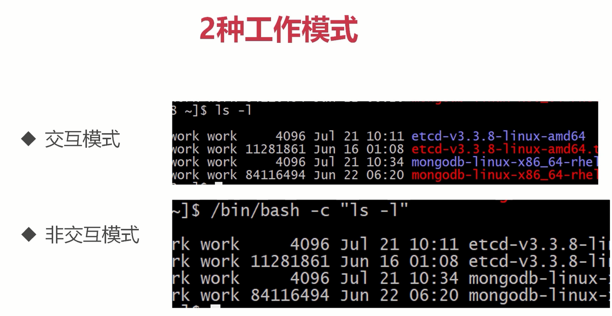
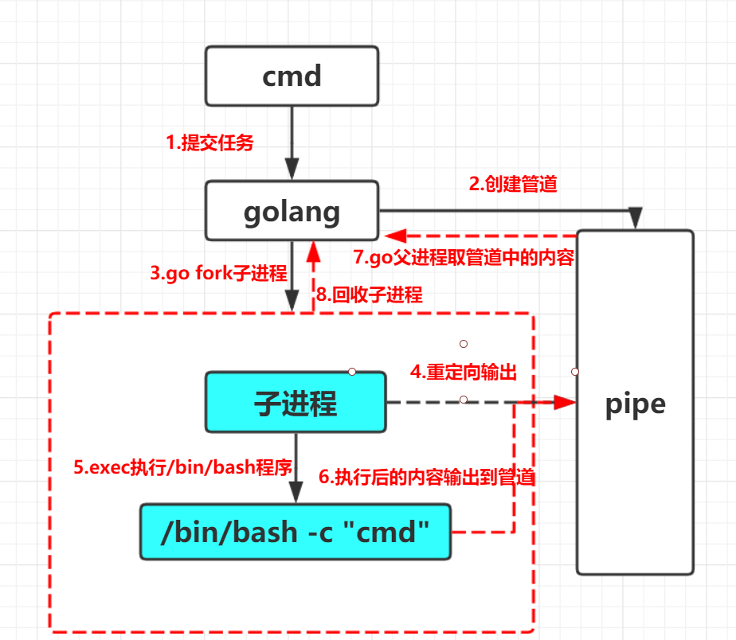

# shell 命令初识

主要记录 go 调用并执行命令的过程

## 先了解 bash 命令解释器的 2 种工作模式

- 交互模式，直接编写命令，输出结果
- 非交互模式，类似程序调用，传参，然后 bash 解释器参数，最后显示结果

如图：

## go 调用 shell 执行任务的底层原理

以输入命令：`cmd` 为例，图示 shell 执行的底层原理：

## go 调用 shell 执行任务涉及的系统调用

- `pipe()`:创建 2 个文件描述符，`fd[0]`可读，`fd[1]`可写；子进程向 `fd[1]`写进去管道的输出，父进程 golang 则从 `fd[0]`读取管道中的输出
- `fork()`:创建子进程，`fd[1]`被继承到子进程；因为当 golang 创建一个子进程时，pipe 会自然的继承到子进程中，所以子进程可以拿到 `fd[1]`
- `dup2()`:重定向子进程 `stdout/stderr`(标出输出/标准错误) 到 `fd[1]`
- `exec()`:在当前进程内,加载并执行二进制程序；子进程通过 exec 执行 `/bin/bash`程序，而其又执行力里面的命令 `cmd`，命令的输出会被写入到 `fd[1]`中，所以 golang `fd[0]`就可以读取到 `fd[0]`的输出

golang `command` 库(定义在 `os/exec` 包)已经封装了所有上述底层细节，我们直接使用即可
