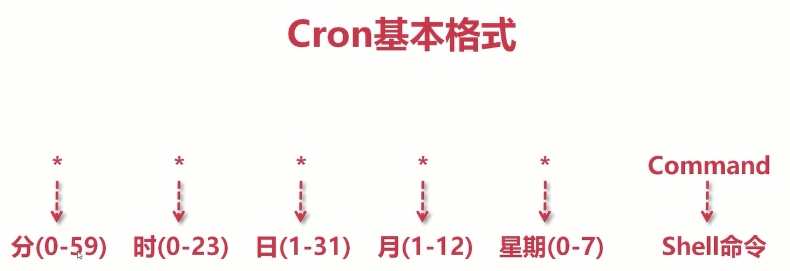

# Cron 表达式

Cron 表达式是一个字符串，字符串以 5 或 6 个空格隔开，分为 6 或 7 个域，每一个域代表一个含义，Cron 有如下两种语法格式：

```
1.Seconds Minutes Hours DayofMonth Month DayofWeek Year

2.Seconds Minutes Hours DayofMonth Month DayofWeek
```

## 一.结构

corn 从左到右（用空格隔开）：秒 分 小时 月份中的日期 月份 星期中的日期 年份，常用的结构如图：


## 二.各字段的含义

|          字段          | 允许值                                        | 允许的特殊字符            |
| :--------------------: | :-------------------------------------------- | :------------------------ |
|     秒（Seconds）      | 0~59 的整数                                   | , - \* / 四个字符         |
|     分（Minutes）      | 0~59 的整数                                   | , - \* / 四个字符         |
|     小时（Hours）      | 0~23 的整数                                   | , - \* / 四个字符         |
|   日期（DayofMonth）   | 1~31 的整数（但是你需要考虑你月的天数）       | ,- \* ? / L W C 八个字符  |
|     月份（Month）      | 1~12 的整数或者 JAN-DEC ，不区分大小写        | , - \* / 四个字符         |
|   星期（DayofWeek）    | 0~6 的整数或者 SUN-SAT （0=SUN）,不区分大小写 | , - \* ? / L C # 八个字符 |
| 年(可选，留空)（Year） | 1970~2099                                     | , - \* / 四个字符         |

**注意事项：**
每一个域都使用数字，但还可以出现如下特殊字符，它们的含义是：

（1）\*：表示匹配该域的任意值。假如在 Minutes 域使用\*, 即表示每分钟都会触发事件。

（2）?：只能用在 DayofMonth 和 DayofWeek 两个域。它也匹配域的任意值，但实际不会。因为 DayofMonth 和 DayofWeek 会相互影响。例如想在每月的 20 日触发调度，不管 20 日到底是星期几，则只能使用如下写法： 13 13 15 20 _ ?, 其中最后一位只能用？，而不能使用_，如果使用\*表示不管星期几都会触发，实际上并不是这样。

（3）-：表示范围。例如在 Minutes 域使用 5-20，表示从 5 分到 20 分钟每分钟触发一次

（4）/：表示起始时间开始触发，然后每隔固定时间触发一次。例如在 Minutes 域使用 5/20,则意味着 5 分钟触发一次，而 25，45 等分别触发一次.

（5）,：表示列出枚举值。例如：在 Minutes 域使用 5,20，则意味着在 5 和 20 分每分钟触发一次。

（6）L：表示最后，只能出现在 DayofWeek 和 DayofMonth 域。如果在 DayofWeek 域使用 5L,意味着在最后的一个星期四触发。

（7）W:表示有效工作日(周一到周五),只能出现在 DayofMonth 域，系统将在离指定日期的最近的有效工作日触发事件。例如：在 DayofMonth 使用 5W，如果 5 日是星期六，则将在最近的工作日：星期五，即 4 日触发。如果 5 日是星期天，则在 6 日(周一)触发；如果 5 日在星期一到星期五中的一天，则就在 5 日触发。另外一点，W 的最近寻找不会跨过月份 。

（8）LW:这两个字符可以连用，表示在某个月最后一个工作日，即最后一个星期五。

（9）#:用于确定每个月第几个星期几，只能出现在 DayofMonth 域。例如在 4#2，表示某月的第二个星期三。

### 三.常用表达式例子

（1）0 0 2 1 _ ? _ 表示在每月的 1 日的凌晨 2 点调整任务

（2）0 15 10 ? \* MON-FRI 表示周一到周五每天上午 10:15 执行作业

（3）0 15 10 ? 6L 2002-2006 表示 2002-2006 年的每个月的最后一个星期五上午 10:15 执行作

（4）0 0 10,14,16 \* \* ? 每天上午 10 点，下午 2 点，4 点

（5）0 0/30 9-17 \* \* ? 朝九晚五工作时间内每半小时

（6）0 0 12 ? \* WED 表示每个星期三中午 12 点

（7）0 0 12 \* \* ? 每天中午 12 点触发

（8）0 15 10 ? \* \* 每天上午 10:15 触发

（9）0 15 10 \* \* ? 每天上午 10:15 触发

（10）0 15 10 \* _ ? _ 每天上午 10:15 触发

（11）0 15 10 \* \* ? 2005 2005 年的每天上午 10:15 触发

（12）0 _ 14 _ \* ? 在每天下午 2 点到下午 2:59 期间的每 1 分钟触发

（13）0 0/5 14 \* \* ? 在每天下午 2 点到下午 2:55 期间的每 5 分钟触发

（14）0 0/5 14,18 \* \* ? 在每天下午 2 点到 2:55 期间和下午 6 点到 6:55 期间的每 5 分钟触发

（15）0 0-5 14 \* \* ? 在每天下午 2 点到下午 2:05 期间的每 1 分钟触发

（16）0 10,44 14 ? 3 WED 每年三月的星期三的下午 2:10 和 2:44 触发

（17）0 15 10 ? \* MON-FRI 周一至周五的上午 10:15 触发

（18）0 15 10 15 \* ? 每月 15 日上午 10:15 触发

（19）0 15 10 L \* ? 每月最后一日的上午 10:15 触发

（20）0 15 10 ? \* 6L 每月的最后一个星期五上午 10:15 触发

（21）0 15 10 ? \* 6L 2002-2005 2002 年至 2005 年的每月的最后一个星期五上午 10:15 触发

（22）0 15 10 ? \* 6#3 每月的第三个星期五上午 10:15 触发

**加强理解：**

(1) 有些子表达式能包含一些范围或列表

例如：子表达式（天（星期））可以为 `MON-FRI`，`MON，WED，FRI`，`MON-WED,SAT`

(2) `\*`字符代表所有可能的值

因此，`\*`在子表达式（月）里表示每个月的含义，`\*`在子表达式（天（星期））表示星期的每一天

(3) `/`字符用来指定数值的增量

例如：在子表达式（分钟）里的`0/15`表示从第 0 分钟开始，每 15 分钟

在子表达式（分钟）里的`3/20`表示从第 3 分钟开始，每 20 分钟（它和`3，23，43`）的含义一样

(4) `？`字符仅被用于天（**月**）和天（**星期**）两个子表达式，表示不指定值

当 2 个子表达式**其中之一**被指定了值以后，**为了避免冲突**，需要将**另一个子表达式**的值设为`？`

(5) `L` 字符仅被用于天（**月**）和天（**星期**）两个子表达式，它是单词`last`的缩写

但是它在两个子表达式里的含义是不同的:

- 在天（**月**）子表达式中，`L`表示一个**月**的**最后一天**

- 在天（**星期**）自表达式中，`L`表示一个**星期**的**最后一天**，也就是 **SAT**，注意不是 `SUN`

如果在`L`前有具体的内容，它就具有其他的含义了

例如：`6L`表示这个月的倒数第６天，`FRIL`表示这个月的最一个星期五

注意：在使用`L`参数时，不要指定列表或范围，因为这会导致问题
