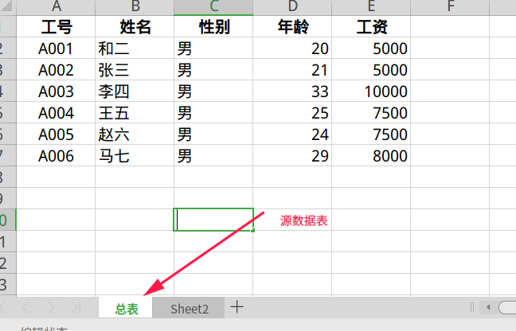
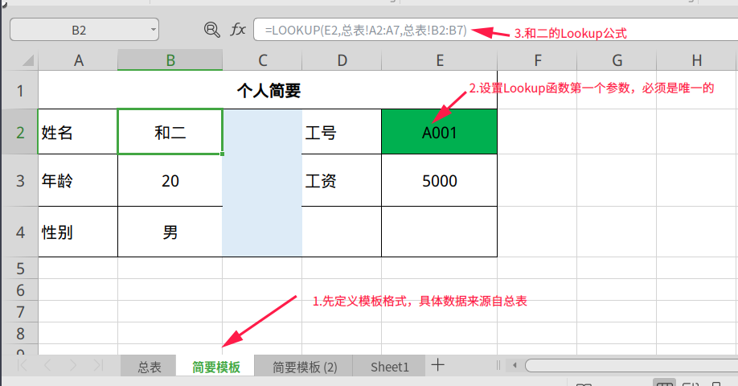
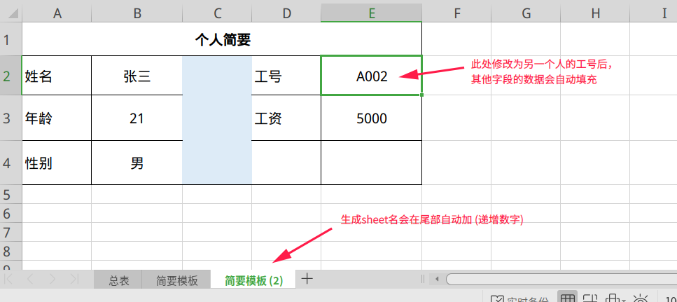

# WPS Excel 模板设置与生成

## 背景
根据给定的Excel生成其他excel。比如sheet1是个总表，sheet2 sheet3....是根据sheet1每行数据填充的同模板的分表。

想做完sheet2的数据关联后，快捷的制作sheet3.....
## 核心知识点

`LOOKUP()`函数的应用：`LOOKUP(lookup_value,lookup_vector,result_vector)`

- `lookup_value`:为函数 LOOKUP 在第一个向量中所要查找的数值。`lookup_value` 可以为数字、文本、逻辑值或包含数值的名称或引用。eg:1或A2等等
- `lookup_vector`:为只包含一行或一列的区域。`lookup_vector` 的数值可以为文本、数字或逻辑值。eg:B2:B10，B列的第2行至第10行为查找值(`lookup_value`)检索范围
- `result_vector`: 只包含一行或一列的区域，其大小必须与 `lookup_vector` 相同。eg:C2:C10，C列的第2行至第10行为返回值检索范围

## Lookup函数基本使用
将示例复制到空白工作表中，可能会更易于理解该示例。照着Lookup函数的内容敲一遍，WPS会高亮显示Lookup()函数中每个参数的实际效果：

## Excel 模板设置与生成
sheet1是源数据表，里面存储个人的基础信息，sheet2、sheet3...都是其他各种版式的表（如sheet2是工资单表，sheet3是简历表....）

为了便于识别，我对每个sheet都进行了命名，先看源数据表，命名为总表：

### 设置模板

简要模板表中数据信息全来自总表，都是通过一个关键字段值进行关联(如图中绿色背景的工号，保证唯一性即可)，不用复制总表得到，可以参考以下图表及公式：

公式解析：
- `E2`： 表示要查找的值
- `总表!`：`总表`对应sheet1的名字，这个可以自定义；`!` 这个感叹号是不能少的，表示要从`总表`读取数据
- `A2:A7`： 表示查找值的 **行检索范围**，从A列的第2行至第7行
- `B2:B2`： 表示返回值的 **行检索范围**，从B列的第2行至第7行
### 根据模板快速生成sheet

1. 鼠标浮动到 `简要模板` 字样上
2. 右键->选`移动或复制工作表`
3. 在弹出框的`下列选定工作表之前:`中，选择`(移至最后)`，这一步主要是选择生成的sheet表位置，一般默认放最后即可
4. 勾选`建立副本`，点`确定`
5. 生成模板后，修改工号，其他字段的内容就会自动修改，图示如下：

