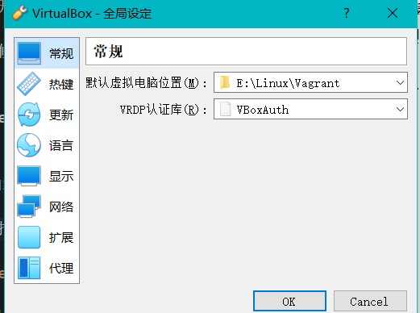
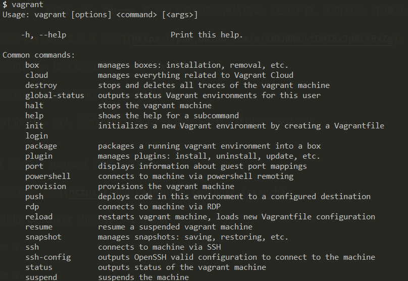
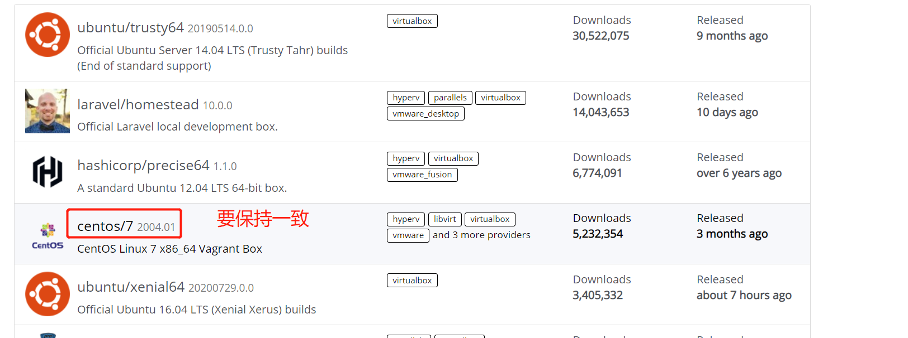
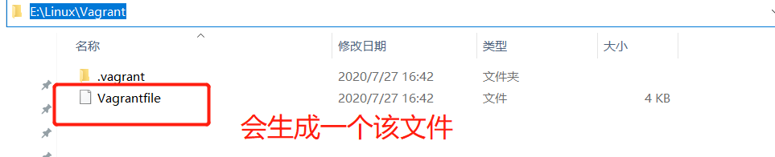
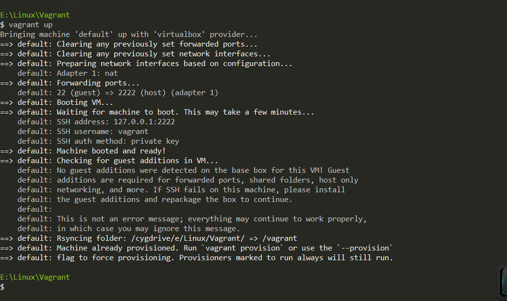
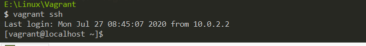

## 一.下载并安装 Virtual Box 过 VMware

个人使用的是 [Virtual Box](https://www.virtualbox.org/)

下载后安装即可，修改下安装路径，其他的步骤直接 next 就行

## 二.修改 virtual box 默认安装的虚拟机位置

点击 virtual box 界面中的 **工具**-》**全局设定**-》**常规**-》**默认虚拟电脑位置**，如图：



自定义路径

## 三.下载 vagrant

官网下载安装[vagrant](https://www.vagrantup.com/)，下载会比较慢。

个人遇到的问题：下载了一半，Chrome 左下角下载处提示网络错误，无法下载。不用担心，右键点击继续下载即可。

[提供 vagrant 2.2.9 版本](https://pan.baidu.com/s/1Nkh0WUvtDM18xJp0LY9xZg)，提取码：7xd4

安装也简单，修改安装路径，一路 next 即可。

安装完后会提示需要重启电脑，重启即可

重启后，打开命令行，输入 `vagrant` 显示一大堆命令参数文档即表示安装正确，如图：



## 四.使用 vagrant 创建虚拟机

[官方镜像仓库](https://app.vagrantup.com/boxes/search)

以使用 Centos/7 镜像为例创建一个虚拟机

### 1.新建一个空目录，并初始化 centos/7

个人是专门新建一个目录：E:\Linux\Vagrant，然后在该目录下打开命令行，运行以下命令来初始化 centos/7

```sh
vagrant init centos/7
```

**注意： init 后的镜像名字一定要和镜像仓库一致！**

如图：



初始化成功后，会在当前目录生成一个 `Vagrantfile` 文件，如图：



### 2. 启动虚拟机

运行以下命令

```sh
vagrant up
```

第一次需要从官网镜像仓库下载对应的镜像并启动，所以需要等待一会。之后就快多了

启动成功如图：



默认使用的是 vagrant 账号创建的连接，可以从图中看出 `SSH username:vagrant`

root 用户的密码为：`vagrant`

### 3. ssh 连接虚拟机

使用 vagrant 用户连接虚拟机

```sh
vagrant ssh
```

连接成功如图：



退出输入 `exit`命令 回车即可。

至此使用 vagrant 创建虚拟机完成，在 Virtual Box 中可以看到虚拟运行状态，当然下次启动虚拟机也可以直接通过 virtual box 来启动，不输入 `vagrant up`命令也行

如果上述三步都成功运行了，会在 Virtual Box 看到已经成功运行的虚拟机，如图：


