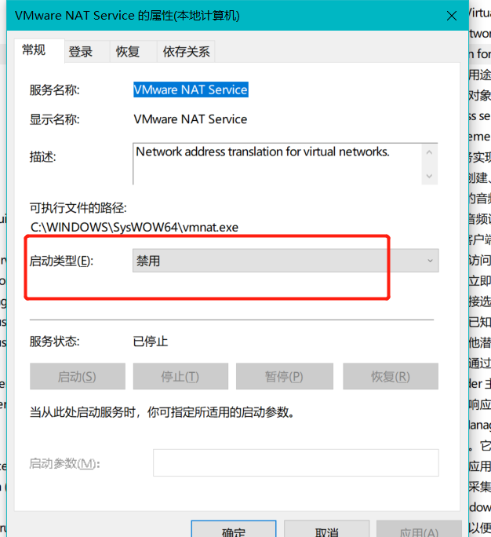
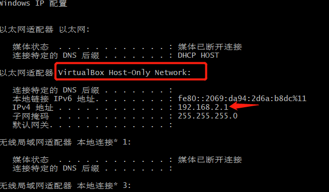
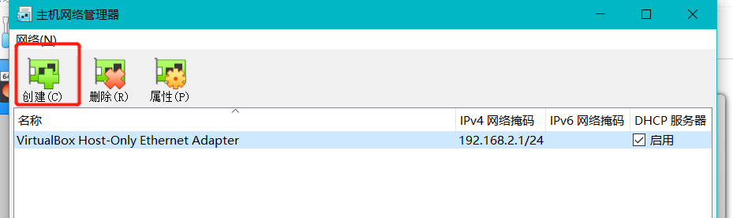
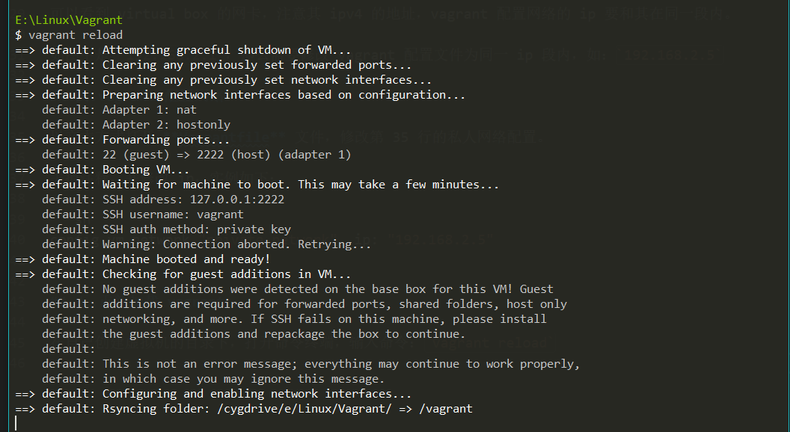

# vagrant 配置网络

## 一.查看自己电脑 ip

windows 下的命令: `ipconfig`

但是我遇到了一个问题：

> 已经忘了是什么时候使用的 vmware 了，很早就通过安装包卸载了，但是并没有卸载干净，导致命令终端只显示 vmware 的网卡配置，没有 virtual box 的网卡配置。

这直接导致无法通过 vagrant 配置虚拟机网络

## 二.解决问题

### 1.卸载干净 vmware 并处理相关网路设置

1. 删除注册表信息。win + r，输入 `regedit`，注册表窗口搜索 `vmware` 关键字，然后把搜出来的相关结果都删掉
2. 删除网卡配置。 win + q 搜索 **网路适配器**，然后在打开的程序中找到 **网络适配器** ，将其下面的 VMware 开头的网卡都删掉
3. 禁用 vmware 相关服务。win + r ，输入 `services.msc`，服务窗口中找到 vmware 开头的服务，双击，然后 **禁用**。如图：



## 三.再次查看网络 ip

输入命令：`ipconfig`



可以看到 virtual box 的网卡，注意其 ipv4 的地址，vagrant 配置网络的 ip 要和其在同一段内。

如图中是 `192.168.2.1`，那么需要修改 vagrant 配置文件为同一 ip 段内，如：`192.168.2.5`

如果还是看不到 virtual box 的网卡，那么需要自己去设置一下网络(默认是设置好的)：

- 打开 virtual box，按 ctrl + h，在弹出的窗口中点击创建按钮，等待自动设置网络即可。如图：



## 四.vagrant 配置网络

以文本方式打开 **Vagrantfile** 文件，该文件是执行 `vagrant init xxx(镜像名称)` 命令后生成的。

修改其第 35 行的私人网络配置，去掉注释，并修改 ip，实例如下：

```sh
config.vm.network "private_network", ip: "192.168.2.5"
```

## 五.重新加载 vagrant

在**Vagrantfile** 文件所在目录下，打开命令终端，输入命令：`vagrant reload`，如图：



## 六.测试网络，看是否同能和主机 ping 通

主机(windows)ping 虚拟机 ip： `ping 192.168.2.5`

虚拟机 ping 主机：`192.168.121.5` (自行看自己电脑 ip)
